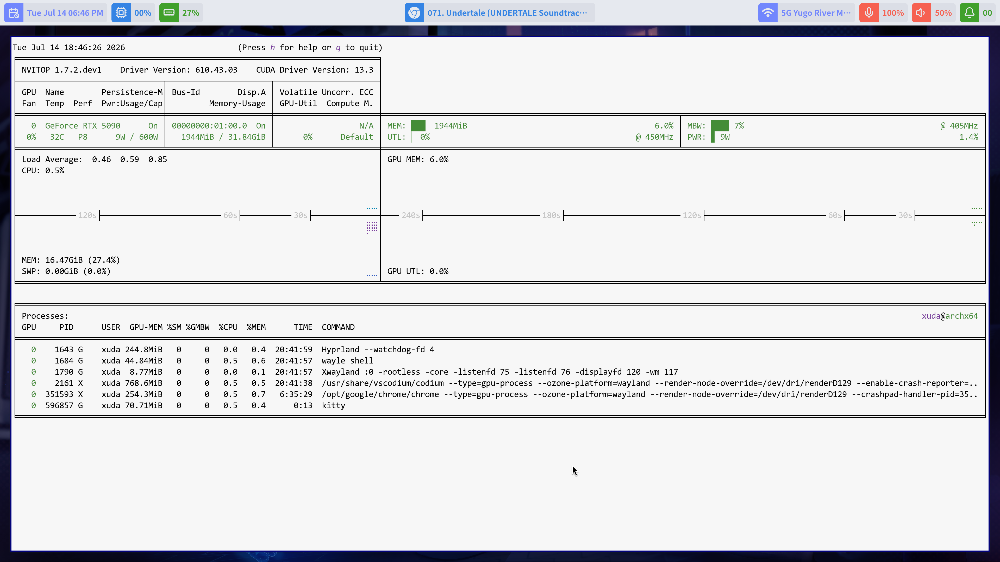

## Personal Configuration Guide

*By Xuda Ye — [ye481@purdue.edu](mailto:ye481@purdue.edu)*

This document picks up where [INSTALL.md](INSTALL.md) leaves off. The base system from the installation guide is intentionally minimal — enough to boot, log in, and reach the network, but nothing more. The sections below cover the additional packages I install on every fresh Arch machine to turn it into a daily-driver workstation: a friendlier shell, a tiling Wayland compositor, working audio and video, common command-line utilities, GPU drivers, an AUR helper, and a handful of GUI applications.

Feel free to cherry-pick. Each section is self-contained, so you can run only the ones that apply to your setup.

### Install zsh and Oh My Zsh

`zsh` is an interactive shell with significantly better completion, history, and theming than `bash`. [Oh My Zsh](https://ohmyz.sh/) is a community framework that bundles hundreds of plugins and themes on top of `zsh`, and is by far the easiest way to get a polished prompt out of the box.

Install both `zsh` and `git` — the latter is needed by Oh My Zsh's installer, which clones its repo:

```bash
sudo pacman -S zsh git
```

Then install Oh My Zsh — the official one-line installer pulls the framework into `~/.oh-my-zsh` and offers to switch your default login shell to `zsh`:

```bash
sh -c "$(curl -fsSL https://raw.githubusercontent.com/ohmyzsh/ohmyzsh/master/tools/install.sh)"
```

After it finishes, log out and back in so the shell change takes effect. Theme and plugin configuration is then done via `~/.zshrc`.

### Install yay (AUR helper)

Arch's official repositories cover most software, but a lot of community packages — proprietary apps, dev tools, niche utilities — live in the [Arch User Repository (AUR)](https://aur.archlinux.org/). `yay` is a friendly `pacman`-like wrapper that automates downloading, building, and installing AUR packages. Bootstrap it once by building it from source:

```bash
git clone https://aur.archlinux.org/yay.git
cd yay
makepkg -si
cd .. && rm -rf yay   # the build directory is no longer needed
```

After this initial bootstrap, `yay` itself is a regular installed package and updates alongside the rest of the system via `yay -Syu`.

### Install Hyprland

[Hyprland](https://hypr.land/) is a modern, GPU-accelerated tiling Wayland compositor. The package list below installs Hyprland itself together with the supporting pieces I rely on day-to-day:

```bash
sudo pacman -S kitty dolphin qt5-wayland qt6-wayland \
               hyprland hyprlauncher hyprshutdown hyprpolkitagent \
               xdg-desktop-portal-hyprland
```

What each package does:

- **`hyprland`** — the compositor (the window manager itself).
- **`kitty`** — a fast, GPU-accelerated terminal emulator. My preferred terminal under Hyprland.
- **`dolphin`** — KDE's graphical file manager.
- **`hyprlauncher`** — an application launcher for Hyprland.
- **`hyprshutdown`** — an application that cleanly exits the Hyprland session.
- **`hyprpolkitagent`** — the polkit authentication agent (lets GUI apps prompt for your password when they need root).
- **`xdg-desktop-portal-hyprland`** — implements XDG desktop portals on Hyprland (needed for screen sharing, file pickers in flatpak apps, etc.).
- **`qt5-wayland`** / **`qt6-wayland`** — Qt platform plugins so Qt apps render natively on Wayland instead of falling back to XWayland.

The matching configuration files I use live under [config/hypr/](config/hypr/) and [config/kitty/](config/kitty/) in this repo — copy them into `~/.config/` after installation.

> **Note:** the classic `hyprland.conf` (hyprlang) format is now deprecated — see the [Hyprland docs](https://wiki.hypr.land/Configuring/Start/). A Lua config (`hyprland.lua`) is the recommended way to configure Hyprland going forward, so this repo ships `config/hypr/hyprland.lua` instead.

Once installed and configured, start the compositor from the TTY (text-mode login) with:

```bash
start-hyprland
```

Hyprland, like any desktop environment, renders your screen on the GPU — but its minimalism makes it dramatically lighter than the alternatives. On my 4K @ 120 Hz panel its resident VRAM footprint sits around 0.5 GB, which leaves plenty of headroom for heavy GPU workloads like deep-learning training. And on the rare occasion you want a *pure* compute environment, you can simply exit Hyprland back to the TTY with `Super+M`.

If you also want the discrete GPU fully untouched by the desktop — `nvidia-smi` reading 0 % even while Hyprland is running — and your CPU has integrated graphics with a display output, there's a simpler trick than fiddling with Wayland's render-device settings or installing extra software:

- **Plug your HDMI/DP cable into the motherboard's video output rather than the graphics card.** The desktop is then composited by the iGPU, leaving the full VRAM and all of the dGPU's compute cores available for headless workloads like deep-learning training. Swap the cable back into the graphics card when you need the dGPU to drive the monitor directly — for example when doing real 3D-object rendering in games or Blender's interactive viewport.

On laptops none of this applies: hybrid-graphics models already wire the internal display to the iGPU by default.

> **Note:** If you do not intend to use Wayle, install `dunst` for notifications and `hyprpaper` for wallpaper management with `sudo pacman -S dunst hyprpaper`.

### Install Wayle

[Wayle](https://wayle.app/) is a Wayland desktop shell that combines a desktop bar, notifications, an on-screen display (OSD), wallpaper management, and device controls in one application. It provides a prebuilt package for Arch Linux and native integration with Hyprland, making it a convenient way to manage the desktop without running separate bar, notification, and wallpaper programs.

Install the prebuilt package from the AUR with `yay`:

```bash
yay -S wayle-bin
```

Wayle exposes its desktop services through the `wayle <COMMAND>` interface:

- **`audio`**, **`media`**, and **`power`** — control audio devices, media playback, and power profiles.
- **`notify`**, **`panel`**, and **`systray`** — manage notifications, the desktop panel, and system tray items.
- **`wallpaper`** and **`idle`** — manage wallpapers and idle inhibition.
- **`config`** and **`icons`** — manage Wayle's configuration and icon assets.
- **`shell`** — run the complete desktop shell in the foreground.
- **`completions`** — generate shell completions.

Run `wayle` without a subcommand to display the complete command list and usage information. To launch the desktop shell in the foreground and bring up the bar manually, run:

```bash
wayle shell
```

The [Hyprland configuration shipped with this repo](config/hypr/hyprland.lua) runs `wayle shell` automatically when the Hyprland session starts, so the manual command is mainly useful for testing and troubleshooting.

Set the wallpaper to Hyprland's bundled default image with:

```bash
wayle wallpaper set /usr/share/hypr/wall2.png
```

To use a different wallpaper, replace `/usr/share/hypr/wall2.png` with the path to any image you prefer.

Open Wayle's graphical configuration window with:

```bash
wayle-settings
```

> **Current limitation:** `wayle-settings` does not currently provide a wallpaper picker. This is an odd omission, but for now the direct way to change the wallpaper is to run `wayle wallpaper set <PATH>` from the command line.

My Wayle settings live under [config/wayle/](config/wayle/) and are installed by the [settings-copy step](#copy-my-settings-of-hyprland-wayle-kitty-micro-and-vs-code) later in this guide.

### Audio and video playback

Modern Arch uses [PipeWire](https://wiki.archlinux.org/title/PipeWire) as the unified audio/video server, with WirePlumber as its session manager. This combination replaces the older PulseAudio + JACK stack and works out of the box for both desktop apps and pro-audio workflows.

```bash
sudo pacman -S usbutils pipewire pipewire-alsa pipewire-pulse \
               alsa-utils wireplumber mpv
```

- **`pipewire`** — the core audio/video server.
- **`pipewire-alsa`** / **`pipewire-pulse`** — drop-in compatibility layers so existing ALSA and PulseAudio applications transparently route through PipeWire.
- **`wireplumber`** — PipeWire's session and policy manager.
- **`alsa-utils`** — provides `alsamixer` and other low-level tooling for inspecting/debugging sound cards.
- **`usbutils`** — `lsusb` and friends, useful when diagnosing USB audio devices.
- **`mpv`** — a minimal, scriptable media player. Good default for both local video files and streamed URLs.

After installation, the user-level PipeWire services should auto-start on next login. Test playback with `mpv <some-file>` or `speaker-test -c 2`.

### System-level utilities

A grab-bag of small tools I find myself reaching for constantly:

```bash
sudo pacman -S curl cmake os-prober trash-cli zip unzip \
               man-db imagemagick grim slurp rsync okular \
               gwenview fastfetch btop xorg-xrdb
```

- **`curl`**, **`cmake`** — fundamental dev tooling (`git` was already installed earlier alongside Oh My Zsh).
- **`os-prober`** — detects other operating systems on the disk (useful if you ever dual-boot and want GRUB to list both).
- **`trash-cli`** — `rm`'s safer cousin: `trash <file>` moves to the freedesktop trash instead of permanently deleting.
- **`zip`** / **`unzip`** — classic archive tools (Arch installs `tar` and `gzip` by default but not these).
- **`man-db`** — populates the `man` database so manual pages are searchable.
- **`imagemagick`** — `convert`, `mogrify`, etc., for command-line image manipulation.
- **`grim`** + **`slurp`** — Wayland-native screenshot tools. `slurp` lets you select a region; `grim` captures it.
- **`rsync`** — incremental file copy/sync, indispensable for backups.
- **`okular`** — KDE's PDF viewer (good annotation support).
- **`gwenview`** — KDE's image viewer.
- **`fastfetch`** — the most-liked system and hardware display tool. Print a nicely formatted summary of your distro, kernel, CPU, GPU, memory, etc. by simply running `fastfetch` (the modern successor to `neofetch`).
- **`btop`** — convenient system monitor in the terminal. Shows live CPU/memory/disk/network usage with mouse-clickable, color-coded panels — a modern replacement for `top`/`htop`.
- **`xorg-xrdb`** — the X resources database utility. Useful for managing legacy X11 apps (e.g. setting fonts, colors, and DPI via `~/.Xresources`) when running them under XWayland.

### NVIDIA drivers

If your machine has a recent NVIDIA GPU (Turing or newer), the open-source kernel modules are the recommended choice:

```bash
sudo pacman -S nvidia-open nvidia-utils
sudo pacman -S vulkan-icd-loader
```

- **`nvidia-open`** — open-source NVIDIA kernel modules (replaces the legacy `nvidia` package on supported GPUs).
- **`nvidia-utils`** — the proprietary user-space libraries (OpenGL, CUDA stubs, `nvidia-smi`, etc.).
- **`vulkan-icd-loader`** — Vulkan loader, required by most modern games and GPU-accelerated apps.

The NVIDIA kernel modules are not loaded into the currently running kernel — a **reboot** is required before the driver actually takes effect. Without it, `nvidia-smi` will fail and Hyprland may refuse to start.

> ⚠️ **Important:** NVIDIA + Wayland still has rough edges. After installing the drivers, reboot, then verify with `nvidia-smi` that the kernel module loaded correctly. If you see flickering or black screens under Hyprland, consult the [Hyprland NVIDIA page](https://wiki.hypr.land/Nvidia/) for the current set of environment variables and `modprobe` tweaks.

If your card is older than Turing or you encounter issues with the open modules, fall back to the proprietary blob with `sudo pacman -S nvidia nvidia-utils` instead.

`nvidia-open` ships precompiled kernel modules, built against one specific kernel build. In very rare cases it can end up inconsistent with the latest Arch Linux kernel — the modules are installed, but not for the kernel you are actually running, and `nvidia-smi` fails as though the driver were missing. If that happens, either boot the LTS kernel instead, or switch to the DKMS package, which compiles the modules locally against whatever kernel you have:

```bash
sudo pacman -S linux-lts linux-lts-headers      # option 1: boot the LTS kernel instead
sudo pacman -S linux-headers nvidia-open-dkms   # option 2: build the modules locally
```

For graphical GPU monitoring and overclocking, you can use [LACT](https://github.com/ilya-zlobintsev/LACT). Install it and enable its system service with:

```bash
yay -S lact
sudo systemctl enable --now lactd
```

LACT provides controls for GPU and VRAM clock speeds, power limits, thermals, and fan behavior. A sample of my LACT setup is available in [lact.png](media/lact.png).

> ⚠️ **Warning:** GPU overclocking is inherently risky. Unsafe clock, voltage, power, or thermal settings can cause instability, overheating, hardware degradation, and potentially permanent damage to the graphics card. Change these settings only if you understand what they do, make small adjustments, monitor temperatures, and know how to recover from an unstable configuration.

For monitoring NVIDIA GPUs while compute workloads are running, install [nvitop](https://github.com/XuehaiPan/nvitop):

```bash
yay -S nvitop-git
```

Run it with `nvitop` to open a continuously updating, interactive view of GPU utilization, memory usage, temperatures, and running processes. It is essentially a more capable and dynamic alternative to `nvidia-smi`.

<p align="center">
  
</p>

### Install fonts

A working Arch install needs a sensible set of system fonts before any terminal, browser, or document viewer looks right — Latin text, CJK characters, and emoji all live in separate font files. The following bundle covers everything used by my Hyprland / kitty setup and by the fontconfig defaults in [config/fontconfig/fonts.conf](config/fontconfig/fonts.conf):

```bash
yay -S ttf-dejavu ttf-liberation noto-fonts \
        noto-fonts-cjk noto-fonts-emoji consolas-font
```

- **`ttf-dejavu`** — the long-standing default sans/serif/mono family on most Linux distros; widely assumed as a fallback by other software.
- **`ttf-liberation`** — metric-compatible replacements for Arial / Times New Roman / Courier New, so documents authored on Windows render with the right line breaks.
- **`noto-fonts`** + **`noto-fonts-cjk`** + **`noto-fonts-emoji`** — Google's "no tofu" family. Covers virtually every Unicode script plus full-color emoji. The `-cjk` package is what makes Chinese/Japanese/Korean text display correctly.
- **`consolas-font`** (AUR) — Microsoft's Consolas, packaged for Arch by the community. Used as the regular (non-Nerd) Consolas family on this system.

#### Install Consolas Nerd Font

The patched **Consolas Nerd Font** (used by the kitty config in this repo) is not available in any package repository — it has to be installed manually from the `.ttf` files. This repo ships them under [fonts/](fonts/); copy them into your per-user font directory and refresh the font cache:

```bash
mkdir -p ~/.local/share/fonts
cp fonts/ConsolasNerdFont_*.ttf ~/.local/share/fonts/
fc-cache -fv
```

After this, `fc-list | grep -i "consolas nerd"` should list both the Regular and Italic variants, and kitty will pick them up automatically on next launch.

### Chinese input method

[Fcitx5](https://fcitx-im.org/) is the most widely used input method framework on modern Linux desktops. For typing Chinese (and other CJK languages), install the framework plus the Chinese add-on bundle and the graphical configuration tool:

```bash
yay -S fcitx5 fcitx5-chinese-addons
yay -S fcitx5-configtool
```

- **`fcitx5`** — the core input method framework.
- **`fcitx5-chinese-addons`** — bundles Pinyin, Shuangpin, Wubi, and Cangjie engines.
- **`fcitx5-configtool`** — a GUI for adding/reordering input methods and tweaking key bindings.

Two helper commands you will use regularly:

- **`fcitx5-remote`** — activates (starts) the Fcitx5 service. Run it once after login if Fcitx5 is not already autostarted by your session; my `hyprland.lua` autostarts it (via `hl.exec_cmd` in the `hyprland.start` hook) so it launches with the desktop.
- **`fcitx5-configtool`** — opens the configuration GUI, where you add **Pinyin** (or whichever engine you prefer) to the active input method list and tweak key bindings.

The default toggle to switch between Chinese and English is **Ctrl+Space**.

### Install TeX Live

Install TeX Live with the AUR installer:

```bash
yay -S texlive-installer
```

The installation is a bit slow, but this method is simple and safe.

> ⚠️ **Be cautious with the AUR `texlive-full` meta-package.** During the build it sometimes fetches a newer release straight from the upstream TeX Live website that is ahead of the version currently in the AUR, leaving you with a mix of versions that no longer line up with the official Arch `texlive-*` packages and can break compilations until things resync. Use `texlive-installer` as shown above instead.

### Useful third-party applications

A short list of applications I always install. Some live in the AUR (installed via `yay`), others are already in the official Arch repositories:

```bash
yay -S google-chrome
yay -S visual-studio-code-bin
yay -S github-cli
yay -S yazi
```

- **`google-chrome`** — Google's official Chrome browser (the open-source upstream is `chromium`, also in the main repos).
- **`visual-studio-code-bin`** — Microsoft's official VS Code binary (the `-bin` suffix indicates a prebuilt package; building from source is also possible via the `code` package but takes much longer).
- **`github-cli`** — GitHub's official command-line tool (`gh`). Great for cloning repos, opening pull requests, and authenticating `git push`/`pull` without juggling personal access tokens. Run `gh auth login` once after installation to link the CLI to your GitHub account.
- **`yazi`** — A fast Rust terminal file manager with inline image previews, especially handy over SSH connections. Its icons are Nerd Font glyphs, so a Nerd Font (e.g. the **Consolas Nerd Font** [shipped here](fonts/)) must be installed. [Official site](https://yazi-rs.github.io/).

<p align="center">
  
</p>

Add anything else here that you find yourself installing repeatedly — `yay -Ss <keyword>` is a quick way to search both the official repos and the AUR at once.

### Btrfs snapshots with btrbk

If your root filesystem is Btrfs, [btrbk](https://digint.ch/btrbk/) gives you on-demand snapshots with retention in a single command — no daemon, no systemd timer. I use it for quick safety snapshots before risky updates or experiments.

```bash
sudo pacman -S btrbk
```

Install the config shipped in this repo and create the snapshot directory:

```bash
sudo install -Dm644 config/btrbk/btrbk.conf /etc/btrbk/btrbk.conf
sudo mkdir -p /.snapshots
```

The config (see [config/btrbk/btrbk.conf](config/btrbk/btrbk.conf)) snapshots the root subvolume into `/.snapshots/`, keeps 7 daily + 4 weekly versions, and never prunes anything less than 2 days old. Trigger it manually whenever you want — each run takes a fresh snapshot and prunes anything past its retention window:

```bash
sudo btrbk -n run   # dry-run — preview the actions; touches nothing on disk
sudo btrbk run      # actually create snapshot + prune
sudo btrbk list snapshots
```

The `-n` (dry-run) flag is worth getting in the habit of: btrbk prints exactly which subvolumes it *would* snapshot and which old ones it *would* delete, but skips every actual btrfs call. Treat it as a preview of what the real `btrbk run` will do — useful for sanity-checking a config change before letting it touch your filesystem.

Restore a file by copying it back out of `/.snapshots/<timestamp>/`, or roll the whole subvolume back with `btrfs subvolume snapshot` in the other direction. If you ever want this to run on a schedule, enable the `btrbk.timer` unit shipped by the package.

### Copy my settings of Hyprland, Wayle, kitty, micro and VS Code

From the root of this cloned repository, drop my dotfiles into `~/.config/` and install the Consolas Nerd Font that the kitty config depends on (the font block is repeated from the [Install fonts](#install-fonts) section above — running it twice is harmless):

```bash
mkdir -p ~/.config ~/.config/Code/User ~/.local/share/fonts
cp -r config/{hypr,wayle,kitty,micro} ~/.config/
cp config/Code/{settings.json,keybindings.json} ~/.config/Code/User/
cp fonts/ConsolasNerdFont_*.ttf ~/.local/share/fonts/
fc-cache -fv
```

This populates `~/.config/hypr/`, `~/.config/wayle/`, `~/.config/kitty/`, and `~/.config/micro/` in one shot, drops my VS Code `settings.json` and `keybindings.json` into `~/.config/Code/User/`, plus registers the Nerd Font with fontconfig. If any of those directories already exist with your own settings, back them up first (e.g. `mv ~/.config/hypr ~/.config/hypr.bak`) — `cp -r` overwrites individual files but does not merge them intelligently.

### Configure your monitor

Hyprland does not pick up your monitor's resolution, refresh rate, or scale factor automatically — you have to tell it. The repo's [config/hypr/hyprland.lua](config/hypr/hyprland.lua) ships with the relevant line commented out near the top, because the output name and supported modes are machine-specific.

First, list the connected outputs and the modes they advertise:

```bash
hyprctl monitors
```

Look for the `Monitor <NAME>` header (e.g. `HDMI-A-1`, `DP-1`, `eDP-1`) and the `availableModes` line just below. Pick the resolution and refresh rate you want, then uncomment and edit the `hl.monitor` line in `~/.config/hypr/hyprland.lua`. The fields are `output`, `mode` (`RESOLUTION@REFRESH`), `position`, and `scale`:

```lua
hl.monitor({ output = "HDMI-A-1", mode = "3840x2160@120", position = "0x0", scale = 2 })
```

- **`HDMI-A-1`** — replace with the output name from `hyprctl monitors`.
- **`3840x2160@120`** — resolution and refresh rate. Must be one of the modes listed in `availableModes`.
- **`0x0`** — top-left position in the global layout (only matters with multiple monitors).
- **`2`** — scale factor. On 4K displays I use `2`; on 1440p displays `1.25`–`1.5` is more typical; on 1080p screens stick to `1`. Hyprland prefers integer or simple fractional scales — exotic values like `1.33` can cause blurry XWayland rendering.

Save the file and Hyprland will hot-reload the new monitor settings. If you mistype the output name the screen goes black — first try `Super+M` to close the Hyprland session and drop back to the TTY, where you can fix the line and run `start-hyprland` again. If that keybind no longer responds, switch to a fresh TTY with `Ctrl+Alt+F2`, fix the line there, and switch back with `Ctrl+Alt+F1`.

Wallpaper selection is handled separately by Wayle; see [Install Wayle](#install-wayle) for the default image command and how to choose a different path.

### Wayland and XWayland consistency

Hyprland is a Wayland-native compositor, but a fair number of apps I rely on (most notably WeChat) still ship only X11 builds and run under XWayland. Without a bit of glue, those apps tend to misbehave — wrong window scaling, mismatched cursor sizes, blurry fonts. The snippets below are already baked into [config/hypr/hyprland.lua](config/hypr/hyprland.lua), so you shouldn't need any per-app workarounds. Everything here was tuned on a 4K display at 2× scaling; adjust the numbers to fit your own setup.

Route every toolkit's input method through fcitx5 so Chinese input works in GTK, Qt, and X11 apps alike:

```lua
hl.env("GTK_IM_MODULE", "fcitx")
hl.env("QT_IM_MODULE", "fcitx")
hl.env("XMODIFIERS", "@im=fcitx")
```

Pin a single cursor size across both display servers, and push Electron apps onto native Wayland. `XCURSOR_SIZE` controls XWayland clients while `HYPRCURSOR_SIZE` controls native Wayland ones — keeping them in lockstep prevents the cursor from visibly resizing as you cross between an X11 and a Wayland window. The `ELECTRON_OZONE_PLATFORM_HINT` setting nudges Electron apps like LinuxQQ and Discord to render via Wayland directly instead of going through XWayland, which fixes their HiDPI rendering:

```lua
hl.env("XCURSOR_SIZE", "24")
hl.env("HYPRCURSOR_SIZE", "24")
hl.env("ELECTRON_OZONE_PLATFORM_HINT", "wayland")
```

Bump the DPI hint for legacy X11 apps and disable XWayland's own scaling pass. Writing `Xft.dpi` into `~/.Xresources` and merging it via `xrdb` is what makes apps like WeChat legible on HiDPI screens; `force_zero_scaling` then tells Hyprland not to scale those XWayland surfaces a second time on top of what the app already did:

```lua
hl.exec_cmd([[echo "Xft.dpi: 200" > ~/.Xresources]])
hl.exec_cmd("xrdb -merge ~/.Xresources")

hl.config({
    xwayland = {
        force_zero_scaling = true,
    },
})
```

> **Heads up:** the `echo ... > ~/.Xresources` line **overwrites** `~/.Xresources` on every login. If you already maintain that file for other purposes (custom keysyms, terminal colors, etc.), comment this line out and add `Xft.dpi: 200` to your existing file by hand.

### Install the `open` helper script

`config/local-bin/open` is a small bash dispatcher I keep on `PATH` so that typing `open <file>` (or `open <url>`) in any shell launches the right app — Chrome for URLs, Dolphin for directories, gwenview for images, mpv for audio/video, okular for PDFs, `xdg-open` for office/archive files, and `micro` (in the current terminal) for everything else. It mirrors the convenience of macOS's `open` command.

```bash
mkdir -p ~/.local/bin
# Heads up: if ~/.local/bin/open already exists, this will overwrite it.
cp config/local-bin/open ~/.local/bin
chmod +x ~/.local/bin/open

# Make sure ~/.local/bin is on $PATH. Append this to ~/.zshrc (or ~/.bashrc):
#   export PATH="$HOME/.local/bin:$PATH"
# Then reopen the shell or `source ~/.zshrc` to pick up the change.
```

The script assumes `gwenview`, `mpv`, `okular`, `micro`, `dolphin`, and `google-chrome-stable` are installed — adjust the `case` block at the top of the file if you prefer different defaults.

> Side note: `~/.local/bin` is also where Claude Code's own installer drops the `claude` binary when you install it from the terminal, so adding the directory to `$PATH` once benefits both this `open` script and any future per-user CLI tools you install there.

### Enable your G6 Sound Blaster (external DAC)

Most Linux distributions ship with rough out-of-the-box support for external USB DACs — playback usually works, but the microphone input is what tends to misbehave (wrong sample rate, no input level, the device appearing in `pavucontrol` but producing silence, etc.). If you happen to be using the [Creative Sound BlasterX G6](https://us.creative.com/p/refurbished/sound-blasterx-g6-b-stock) like I am, the G6-specific setup that used to live in this repo has moved to a standalone project — [`Sound-BlasterX-G6-Control`](https://github.com/xuda-ye-math/Sound-BlasterX-G6-Control). One-line install on Arch:

```bash
yay -S sound-blasterx-g6-control-git
```

See the project's README for the verification steps and the systemd user unit it installs to keep the G6 promoted to the default sink/source across reboots.

### Recording desktop + microphone with OBS Studio

For real voice or screen recording — anything beyond the `arecord` smoke test that the G6 project uses to verify capture — install [OBS Studio](https://obsproject.com/):

```bash
sudo pacman -S obs-studio
```

To record the whole desktop on Hyprland/Wayland, add a **Screen Capture (PipeWire)** source in OBS (`Sources` panel → `+` → `Screen Capture (PipeWire)`) and pick the monitor when the xdg-desktop-portal dialog pops up. As long as your default PipeWire input/output is set correctly (which the G6 project handles automatically if you're on a G6, or which `pavucontrol` lets you set by hand otherwise), OBS will also pick up the microphone and the desktop's internal system audio without further setup. See [`obs.mp4`](media/obs.mp4) for an example clip captured this way (4K screen capture, microphone + internal system sound recorded together).

### A note on my preferences

A few places where this config differs from typical Arch / Hyprland setups:

- **Light background.** The kitty theme uses a near-white background (`#f7f7f7`), suited to my 4K ROG panel. For a more conventional dark look, swap `config/kitty/current-theme.conf` for any theme under `/usr/share/kitty/themes/`.
- **Consolas as system monospace.** My fontconfig pins `Consolas Nerd Font` as the default `monospace` family. Switch to JetBrains Mono, FiraCode, or MesloLGS by editing `config/fontconfig/fonts.conf`.
- **VS Code terminal copy/paste.** My `keybindings.json` rebinds `Ctrl+C` so it copies when there is a selection and sends `SIGINT` (the usual terminal interrupt) when there isn't, and `Ctrl+V` always pastes. This matches the rest of the desktop — selection-aware copy on `Ctrl+C` — at the cost of losing the default "send `Ctrl+C` literally" behavior on an empty selection.
- **Super+letter app launchers.** Hyprland is rebound so the most common apps open with a single Super-key chord:

  | Binding | Action |
  |---|---|
  | `Super+T` | Terminal (`kitty`) |
  | `Super+G` | Google Chrome |
  | `Super+C` | VS Code |
  | `Super+D` | Dolphin (file manager) |
  | `Super+R` | Run / launcher |
  | `Super+Q` | Quit active window |
  | `Super+F` | Fullscreen |
  | `Super+V` | Toggle floating |
  | `Super+M` | Exit Hyprland |
  | `Super+1` … `Super+0` | Workspace 1 … 10 |
  | `Super+Left` / `Super+Right` | Lower / raise system volume (5% step) |
  | `Super+Z` | Screenshot of a slurp-selected region → `$HOME/YYMMDD_HH-MM-SS.png` |
  | `Super+X` | Full-screen screenshot → `$HOME/YYMMDD_HH-MM-SS.png` |

  The screenshot bindings need `grim` and `slurp` (`sudo pacman -S grim slurp`). Neither prints an on-screen confirmation when triggered from the keybind — check `$HOME` for the new file, or run the same command in a terminal to see any error output.

### What it ends up looking like

Once everything above is installed and the dotfiles are in place, the desktop on my ROG machine looks like this:

<p align="center">
  
</p>
