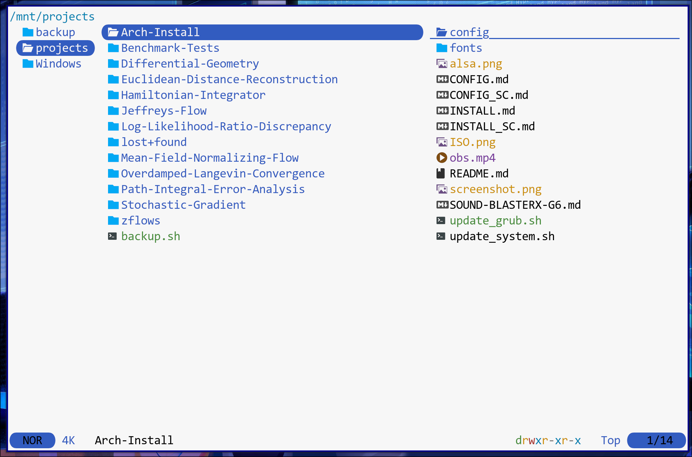
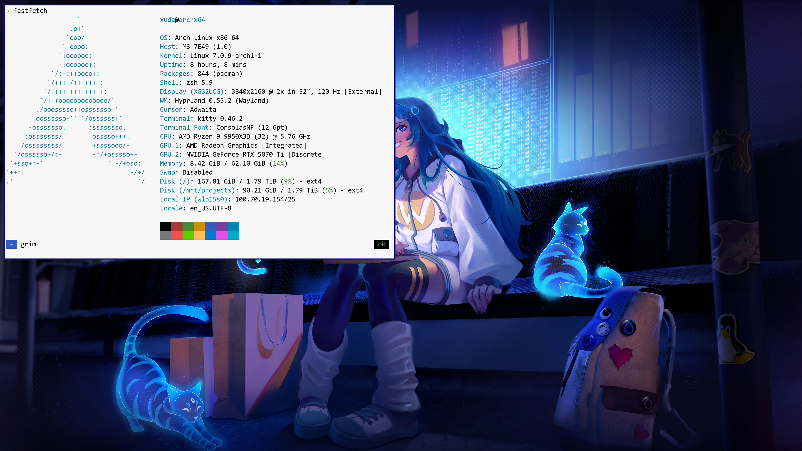

## 个人配置指南

*作者：Xuda Ye — [ye481@purdue.edu](mailto:ye481@purdue.edu)*

本文档承接 [INSTALL_SC.md](INSTALL_SC.md) 结束之处。安装指南得到的基础系统刻意保持最小化——能启动、能登录、能联网，仅此而已。下面的章节涵盖了我在每一台新装好的 Arch 机器上都会额外安装的内容，把它变成一台日常使用的工作站：更友好的 shell、平铺式 Wayland 合成器、可用的音视频、常用命令行工具、显卡驱动、AUR 助手，以及若干 GUI 应用。

可以按需挑选。每一节都自洽完整，只跑你需要的那几节即可。

### 安装 zsh 和 Oh My Zsh

`zsh` 是一种交互式 shell，在补全、历史和主题方面比 `bash` 强得多。[Oh My Zsh](https://ohmyz.sh/) 是建立在 `zsh` 之上的一个社区框架，捆绑了数百个插件和主题，是开箱即得一个精致提示符最简单的方式。

同时安装 `zsh` 和 `git` —— 后者是 Oh My Zsh 安装器克隆仓库时所需：

```bash
sudo pacman -S zsh git
```

接着安装 Oh My Zsh —— 官方的一行式安装器会把框架拉取到 `~/.oh-my-zsh`，并询问是否把默认登录 shell 切换为 `zsh`：

```bash
sh -c "$(curl -fsSL https://raw.githubusercontent.com/ohmyzsh/ohmyzsh/master/tools/install.sh)"
```

完成后，注销再重新登录，shell 的切换才会生效。之后主题和插件的配置都通过 `~/.zshrc` 进行。

### 安装 yay（AUR 助手）

Arch 的官方仓库覆盖了大部分软件，但还有大量社区软件包 —— 专有应用、开发工具、小众实用程序 —— 存在于 [Arch 用户仓库 (AUR)](https://aur.archlinux.org/) 中。`yay` 是一个类似 `pacman` 的友好封装，能自动下载、编译并安装 AUR 软件包。通过从源码构建一次性引导它：

```bash
git clone https://aur.archlinux.org/yay.git
cd yay
makepkg -si
cd .. && rm -rf yay   # 构建目录已不再需要
```

完成这一步初始引导之后，`yay` 自己就是一个普通的已安装软件包了，日常通过 `yay -Syu` 跟其他软件包一起升级。

### 安装 Hyprland

[Hyprland](https://hypr.land/) 是一款现代化的、GPU 加速的平铺式 Wayland 合成器。下面这一条命令安装 Hyprland 本体，以及我日常依赖的配套部件：

```bash
sudo pacman -S kitty dolphin dunst waybar qt5-wayland qt6-wayland \
               hyprland hyprlauncher hyprpaper hyprpolkitagent \
               xdg-desktop-portal-hyprland
```

每个软件包的作用：

- **`hyprland`** —— 合成器本体（也就是窗口管理器）。
- **`kitty`** —— 一款快速、GPU 加速的终端模拟器。是我在 Hyprland 下偏好的终端。
- **`dolphin`** —— KDE 的图形化文件管理器。
- **`dunst`** —— 轻量级通知守护进程（兼容 Wayland）。
- **`waybar`** —— 顶部/底部状态栏（时钟、工作区、系统托盘等）。
- **`hyprlauncher`** —— Hyprland 的应用启动器。
- **`hyprpaper`** —— 壁纸守护进程。
- **`hyprpolkitagent`** —— polkit 认证代理（让 GUI 应用在需要 root 权限时弹出密码提示）。
- **`xdg-desktop-portal-hyprland`** —— 在 Hyprland 上实现 XDG 桌面 portal（屏幕共享、flatpak 应用中的文件选择器等会用到）。
- **`qt5-wayland`** / **`qt6-wayland`** —— Qt 平台插件，让 Qt 应用以原生 Wayland 方式渲染，而不是退回到 XWayland。

我所用的配置文件都在本仓库的 [.config/hypr/](.config/hypr/) 和 [.config/kitty/](.config/kitty/) 下 —— 安装完成后把它们复制到 `~/.config/`。

安装并配置好之后，从 TTY（文本模式登录）中通过下面命令启动合成器：

```bash
start-hyprland
```

Hyprland 和其他桌面环境一样，依赖 GPU 来渲染画面 —— 但凭借它的极简设计，比其他方案要轻得多。在我的 4K @ 120 Hz 屏幕上，Hyprland 常驻的显存占用只有约 0.5 GB，给深度学习训练这类重型 GPU 工作负载留出了非常充裕的余量。如果偶尔需要一个*纯*计算环境，只要按 `Super+M` 就能干净地退出 Hyprland 回到 TTY。相比之下，要让 GNOME 或 KDE Plasma 把 GPU 释放出来，通常得运行类似这样的命令：

```bash
sudo systemctl isolate multi-user.target  # 通用做法
sudo systemctl stop sddm                  # 针对 KDE
```

—— 这些命令需要 root 权限，容易出错，而且偶尔会把机器卡死。

如果还想让独立显卡完全不被桌面占用 —— 即便 Hyprland 正在运行，`nvidia-smi` 也读到 0%，而且你的 CPU 自带集成显卡且主板有视频输出口，有一个比修改 Wayland 渲染设备设置或安装额外软件都更省事的小窍门：

- **把 HDMI/DP 线插到主板的视频输出口上，而不是显卡上。** 桌面就会由 iGPU 合成，dGPU 的整块显存和全部计算核心都空出来给深度学习训练这类无显示需求的工作负载使用。如果需要让 dGPU 直接驱动显示器（例如玩游戏，或者用 Blender 实时视口做真正的 3D 物体渲染时），把线再插回显卡上即可。

笔记本上不必做这些：混合显卡机型默认就已经把内屏接到 iGPU 上了。

### 音视频播放

现代的 Arch 使用 [PipeWire](https://wiki.archlinux.org/title/PipeWire) 作为统一的音视频服务器，以 WirePlumber 作为它的会话管理器。这一组合替代了较旧的 PulseAudio + JACK 体系，无论是桌面应用还是专业音频工作流，都是开箱即用。

```bash
sudo pacman -S usbutils pipewire pipewire-alsa pipewire-pulse \
               alsa-utils wireplumber mpv
```

- **`pipewire`** —— 核心的音视频服务器。
- **`pipewire-alsa`** / **`pipewire-pulse`** —— 兼容层，让现有的 ALSA 和 PulseAudio 应用透明地通过 PipeWire 进行音频路由。
- **`wireplumber`** —— PipeWire 的会话和策略管理器。
- **`alsa-utils`** —— 提供 `alsamixer` 及其他低层工具，用于检查/调试声卡。
- **`usbutils`** —— `lsusb` 及相关工具，在排查 USB 音频设备时很有用。
- **`mpv`** —— 一款极简、可脚本化的媒体播放器。无论是本地视频还是流式 URL，都是不错的默认选择。

安装完成后，用户级的 PipeWire 服务应在下次登录时自动启动。可以用 `mpv <某个文件>` 或 `speaker-test -c 2` 测试播放是否正常。

### 系统级实用工具

下面是我日常常用的一组小工具：

```bash
sudo pacman -S curl cmake os-prober trash-cli zip unzip \
               man-db imagemagick grim slurp rsync okular \
               gwenview fastfetch btop xorg-xrdb
```

- **`curl`**、**`cmake`** —— 基础开发工具（`git` 已经在 Oh My Zsh 那一节随之安装）。
- **`os-prober`** —— 检测磁盘上已有的其他操作系统（如果你将来要双系统并希望 GRUB 同时列出它们，这个很有用）。
- **`trash-cli`** —— `rm` 的更安全替代品：`trash <文件>` 会把文件移到 freedesktop 回收站，而不是永久删除。
- **`zip`** / **`unzip`** —— 经典的归档工具（Arch 默认安装 `tar` 和 `gzip`，但不包含这两个）。
- **`man-db`** —— 构建 `man` 数据库，使手册页可被搜索。
- **`imagemagick`** —— 提供 `convert`、`mogrify` 等命令行图像处理工具。
- **`grim`** + **`slurp`** —— Wayland 原生截图工具。`slurp` 让你选择区域，`grim` 进行截取。
- **`rsync`** —— 增量式文件复制/同步，做备份时必备。
- **`okular`** —— KDE 的 PDF 阅读器（注释支持很好）。
- **`gwenview`** —— KDE 的图像查看器。
- **`fastfetch`** —— 最受欢迎的系统和硬件信息显示工具。只要运行 `fastfetch`，就能打印出格式漂亮的发行版、内核、CPU、GPU、内存等信息摘要（`neofetch` 的现代继任者）。
- **`btop`** —— 终端中方便的系统监视器。以可用鼠标点击、色彩分明的面板实时显示 CPU/内存/磁盘/网络使用情况——`top`/`htop` 的现代替代品。
- **`xorg-xrdb`** —— X 资源数据库工具。在 XWayland 下运行老旧 X11 应用时，可用它通过 `~/.Xresources` 管理字体、颜色、DPI 等设置。

### NVIDIA 显卡驱动

如果你的机器装有较新的 NVIDIA 显卡（Turing 架构或更新），截至 2025 年，开源内核模块是推荐选择：

```bash
sudo pacman -S nvidia-open nvidia-utils
sudo pacman -S vulkan-icd-loader
```

- **`nvidia-open`** —— 开源的 NVIDIA 内核模块（在受支持的 GPU 上替代了旧的 `nvidia` 包）。
- **`nvidia-utils`** —— 专有的用户态库（OpenGL、CUDA stubs、`nvidia-smi` 等）。
- **`vulkan-icd-loader`** —— Vulkan loader，大多数现代游戏和 GPU 加速应用都需要它。

NVIDIA 内核模块并不会被加载进当前运行的内核 —— 驱动要真正生效，需要**重启**。否则 `nvidia-smi` 会失败，Hyprland 也可能拒绝启动。

> ⚠️ **重要：**NVIDIA + Wayland 至今仍有不少粗糙之处。装完驱动后请重启，然后用 `nvidia-smi` 确认内核模块已正确加载。如果在 Hyprland 下看到闪屏或黑屏，请查阅 [Hyprland NVIDIA 页面](https://wiki.hyprland.org/Nvidia/)获取当前一组推荐的环境变量和 `modprobe` 调整。

如果你的显卡比 Turing 更老，或者使用开源模块时遇到问题，可以退回到专有 blob：`sudo pacman -S nvidia nvidia-utils`。

### 安装字体

一个能用的 Arch 安装需要一组合理的系统字体，终端、浏览器、文档查看器才能正常显示 —— 拉丁文、CJK（中日韩）字符、emoji 分别在不同的字体文件中。下面这套字体覆盖了我的 Hyprland / kitty 配置以及 [config/fontconfig/fonts.conf](config/fontconfig/fonts.conf) 中默认设置所需要的一切：

```bash
yay -S ttf-dejavu ttf-liberation noto-fonts \
        noto-fonts-cjk noto-fonts-emoji consolas-font
```

- **`ttf-dejavu`** —— 大部分 Linux 发行版长期以来的默认 sans/serif/mono 字体族；许多软件都默认它作为兜底。
- **`ttf-liberation`** —— 与 Arial / Times New Roman / Courier New 度量兼容的替代字体，这样 Windows 上编写的文档在 Linux 上也能保持正确的换行。
- **`noto-fonts`** + **`noto-fonts-cjk`** + **`noto-fonts-emoji`** —— 谷歌的 "no tofu"（没有豆腐块）字体族。几乎覆盖所有 Unicode 文字以及全彩 emoji。`-cjk` 包就是让中文/日文/韩文能正常显示的关键。
- **`consolas-font`**（AUR）—— 微软的 Consolas，由社区打包到 Arch 上。在本系统中用作常规（非 Nerd）的 Consolas 字体族。

#### 安装 Consolas Nerd Font

打过补丁的 **Consolas Nerd Font**（本仓库的 kitty 配置正在使用）在任何软件仓库中都找不到 —— 必须从 `.ttf` 文件手动安装。本仓库在 [fonts/](fonts/) 下直接附带了这些字体文件；把它们复制到用户字体目录下，然后刷新字体缓存：

```bash
mkdir -p ~/.local/share/fonts
cp fonts/ConsolasNerdFont_*.ttf ~/.local/share/fonts/
fc-cache -fv
```

之后，`fc-list | grep -i "consolas nerd"` 应当能列出 Regular 和 Italic 两个变体，kitty 在下次启动时也会自动识别它们。

### 中文输入法

[Fcitx5](https://fcitx-im.org/) 是现代 Linux 桌面上使用最广泛的输入法框架。要输入中文（或其他 CJK 语言），安装框架本身、中文扩展包，以及图形化配置工具：

```bash
yay -S fcitx5 fcitx5-chinese-addons
yay -S fcitx5-configtool
```

- **`fcitx5`** —— 输入法框架本体。
- **`fcitx5-chinese-addons`** —— 捆绑了拼音、双拼、五笔、仓颉等输入引擎。
- **`fcitx5-configtool`** —— 添加/排序输入法以及调整快捷键的图形化工具。

你会经常用到两条辅助命令：

- **`fcitx5-remote`** —— 激活（启动）Fcitx5 服务。如果你的会话还没有自动启动 Fcitx5，可以在登录后运行一次；我的 `hyprland.conf` 通过 `exec-once` 在桌面启动时一起调用它。
- **`fcitx5-configtool`** —— 打开配置 GUI，在这里把**拼音**（或你偏好的任何引擎）加入到活动输入法列表，以及调整快捷键。

中英文切换的默认快捷键是 **Ctrl+Space**。

### 安装 TeX Live

使用 `pacman` 从 Arch 官方仓库安装 TeX Live 组件：

```bash
sudo pacman -S texlive-basic texlive-bin texlive-binextra texlive-latex \
  texlive-latexextra texlive-latexrecommended texlive-luatex texlive-xetex \
  texlive-fontsrecommended texlive-mathscience texlive-pictures \
  texlive-langchinese texlive-langcjk
```

这是我常用的一组：核心引擎（`texlive-bin`、`texlive-latex`、`texlive-luatex`、`texlive-xetex`）、推荐与扩展的 LaTeX 宏包、数学与科学宏集、绘图支持以及中文/CJK 语言数据。

> ⚠️ **使用 AUR 的 `texlive-full` 元包时要谨慎。** 它在构建过程中有时会直接从 TeX Live 官方网站拉取一个比当前 AUR 版本更新的发行版，这会让你最终装到一组版本不一致的组件，跟官方 Arch 的 `texlive-*` 包对不上号，可能导致编译失败直到版本再次同步。上面这些独立的 `texlive-*` 包通过 `pacman -Syu` 保持一致版本，我觉得更可控。

### 实用第三方应用

我每次都会安装的一些应用。其中有些位于 AUR（通过 `yay` 安装），其他则已经在 Arch 官方仓库中：

```bash
yay -S google-chrome
yay -S visual-studio-code-bin
yay -S github-cli
yay -S yazi
```

- **`google-chrome`** —— 谷歌官方的 Chrome 浏览器（开源上游是 `chromium`，也在主仓库中提供）。
- **`visual-studio-code-bin`** —— 微软官方的 VS Code 二进制版（`-bin` 后缀表示这是一个预编译包；也可以通过 `code` 包从源码编译，但耗时长得多）。
- **`github-cli`** —— GitHub 官方命令行工具（`gh`）。在克隆仓库、提交 pull request 以及在 `git push`/`pull` 中无需折腾 Personal Access Token 等场景下都非常方便。安装后运行一次 `gh auth login` 把 CLI 关联到你的 GitHub 账号。
- **`yazi`** —— 一个用 Rust 写的、速度很快的终端文件管理器，支持图像/媒体的内嵌预览，尤其适合 SSH 远程使用。它的图标依赖 Nerd Font 字形，因此需要安装一款 Nerd Font（例如本仓库[附带的 **Consolas Nerd Font**](fonts/)）。[官方网站](https://yazi-rs.github.io/)。

<p align="center">
  
</p>

如果有其他你反复安装的软件，也可以加在这里 —— `yay -Ss <关键词>` 是一次性搜索官方仓库和 AUR 的便捷方式。

### 使用 btrbk 做 Btrfs 快照

如果你的根文件系统是 Btrfs，[btrbk](https://digint.ch/btrbk/) 能用一条命令完成带保留策略的按需快照 —— 不需要守护进程，也不需要 systemd 计时器。我用它在风险较高的更新或实验之前，先打一个安全快照。

```bash
sudo pacman -S btrbk
```

把本仓库附带的配置文件安装到位，并创建快照目录：

```bash
sudo install -Dm644 config/btrbk/btrbk.conf /etc/btrbk/btrbk.conf
sudo mkdir -p /.snapshots
```

这份配置（见 [config/btrbk/btrbk.conf](config/btrbk/btrbk.conf)）会把根子卷快照到 `/.snapshots/` 下，保留最近 7 个每日 + 4 个每周版本，且永远不会删除 2 天以内的快照。需要时手动触发即可 —— 每次运行都会新建一个快照，并清理掉所有超出保留期的旧快照：

```bash
sudo btrbk -n run   # 试运行 —— 预览要做的动作,不修改磁盘上的任何东西
sudo btrbk run      # 实际创建快照 + 清理
sudo btrbk list snapshots
```

养成使用 `-n`（试运行）的习惯很有好处：btrbk 会清楚地打印出它*将要*快照哪些子卷、*将要*删除哪些旧快照，但完全跳过所有真正的 btrfs 调用。可以把它当作真正 `btrbk run` 的预览 —— 在让配置改动作用到文件系统之前先做个理智检查，非常有用。

要恢复单个文件，从 `/.snapshots/<时间戳>/` 把它复制出来即可；如果要回滚整个子卷，可以反过来用 `btrfs subvolume snapshot` 操作。如果将来想让它按计划运行，启用 btrbk 包里附带的 `btrbk.timer` 单元即可。

### 复制我的 Hyprland、kitty、micro 和 VS Code 配置

在克隆下来的本仓库根目录下，把我的 dotfiles 放入 `~/.config/`，同时安装 kitty 配置所需的 Consolas Nerd Font（字体那一段与上面[安装字体](#安装字体)一节中的命令重复 —— 重复执行也没有副作用）：

```bash
mkdir -p ~/.config ~/.config/Code/User ~/.local/share/fonts
cp -r config/{hypr,kitty,micro} ~/.config/
cp config/Code/{settings.json,keybindings.json} ~/.config/Code/User/
cp fonts/ConsolasNerdFont_*.ttf ~/.local/share/fonts/
fc-cache -fv
```

这一条会把 `~/.config/hypr/`、`~/.config/kitty/`、`~/.config/micro/` 一次性填好，并把我的 VS Code `settings.json` 与 `keybindings.json` 放入 `~/.config/Code/User/`，同时将 Nerd Font 注册到 fontconfig。如果上述目录里已经存有你自己的配置，请先备份（例如 `mv ~/.config/hypr ~/.config/hypr.bak`）—— `cp -r` 会覆盖单个文件，但不会做智能合并。

### 配置你的显示器

Hyprland 不会自动识别显示器的分辨率、刷新率或缩放比例 —— 这些都需要你显式告诉它。本仓库的 [config/hypr/hyprland.conf](config/hypr/hyprland.conf) 在文件开头预留了相关行，但已注释掉，因为输出名称与支持的模式都和具体机器相关。

先列出已连接的输出以及它们公布的可用模式：

```bash
hyprctl monitors
```

留意 `Monitor <名称>` 那一行的输出名（例如 `HDMI-A-1`、`DP-1`、`eDP-1`），以及下方的 `availableModes`。挑好你想要的分辨率和刷新率，然后在 `~/.config/hypr/hyprland.conf` 中取消注释并编辑 `monitor =` 那一行。语法是 `名称, 分辨率@刷新率, 位置, 缩放`：

```bash
monitor = HDMI-A-1, 3840x2160@120, 0x0, 2
```

- **`HDMI-A-1`** —— 替换为 `hyprctl monitors` 显示的输出名。
- **`3840x2160@120`** —— 分辨率与刷新率，必须是 `availableModes` 中列出的某一项。
- **`0x0`** —— 显示器在全局布局中的左上角位置（只有多显示器时才有意义）。
- **`2`** —— 缩放比例。4K 屏我用 `2`；1440p 屏更常见的是 `1.25`–`1.5`；1080p 屏建议保持 `1`。Hyprland 偏好整数或简单的分数缩放 —— 像 `1.33` 这样的奇怪值会让 XWayland 渲染发糊。

保存文件后 Hyprland 会自动热加载新的显示器设置。如果你把输出名拼错了，屏幕会变黑 —— 先尝试按 `Super+M` 关闭 Hyprland 会话回到 TTY，在那里修好这一行后再运行 `start-hyprland`。如果这个快捷键也不响应，用 `Ctrl+Alt+F2` 切到一个新的 TTY，在那里修好后再用 `Ctrl+Alt+F1` 切回去。

### Wayland 与 XWayland 兼容性

Hyprland 是原生 Wayland 合成器，但我日常依赖的不少应用（尤其是微信）目前仍只发布 X11 版本，需要经 XWayland 运行。如果不做一些额外衔接，这些应用很容易表现异常 —— 窗口缩放错误、鼠标指针大小不一致、字体发糊。下面这些片段已经写入了 [config/hypr/hyprland.conf](config/hypr/hyprland.conf)，所以一般不需要再为单个应用做特殊处理。所有数值都是在 4K 屏 2× 缩放下调好的，请按你自己的硬件调整。

把所有工具包的输入法都路由到 fcitx5，这样 GTK、Qt 与 X11 应用都能正常使用中文输入：

```bash
env = GTK_IM_MODULE,fcitx
env = QT_IM_MODULE,fcitx
env = XMODIFIERS,@im=fcitx
```

把鼠标指针在两套显示协议下固定为同一大小，并把 Electron 应用拉到原生 Wayland。`XCURSOR_SIZE` 控制 XWayland 客户端，`HYPRCURSOR_SIZE` 控制原生 Wayland 客户端 —— 让两者保持一致可以避免鼠标在 X11 与 Wayland 窗口之间切换时大小发生跳变。`ELECTRON_OZONE_PLATFORM_HINT` 则会把 LinuxQQ、Discord 这类 Electron 应用从 XWayland 拉到原生 Wayland，缩放与 HiDPI 渲染都会正常很多：

```bash
env = XCURSOR_SIZE,24
env = HYPRCURSOR_SIZE,24
env = ELECTRON_OZONE_PLATFORM_HINT,wayland
```

为传统 X11 应用提高 DPI，并关掉 XWayland 自己的二次缩放。把 `Xft.dpi` 写入 `~/.Xresources` 再通过 `xrdb` 合并，是让微信等应用在 HiDPI 屏上能看清字的关键；`force_zero_scaling` 则告诉 Hyprland 不要在应用已经做过缩放的基础上再叠加一次缩放：

```bash
exec-once = echo "Xft.dpi: 200" > ~/.Xresources
exec-once = xrdb -merge ~/.Xresources

xwayland {
    force_zero_scaling = true
}
```

> **注意：** `echo ... > ~/.Xresources` 这一行会在每次登录时**覆盖** `~/.Xresources`。如果你已经在用这个文件做其他配置（自定义按键映射、终端颜色等），请把它注释掉，并在已有的 `~/.Xresources` 中手动追加 `Xft.dpi: 200`。

### 安装 `open` 辅助脚本

`config/local-bin/open` 是我放在 `PATH` 上的一个小 bash 分发脚本，这样在任何 shell 中输入 `open <文件>`（或 `open <URL>`）都会自动启动合适的应用 —— URL 用 Chrome、目录用 Dolphin、图片用 gwenview、音视频用 mpv、PDF 用 okular、Office 与压缩包交给 `xdg-open`，其余一律在当前终端里用 `micro` 打开。用起来类似于 macOS 的 `open` 命令。

```bash
mkdir -p ~/.local/bin
# 提示: 如果 ~/.local/bin/open 已经存在，这条命令会直接覆盖它。
cp config/local-bin/open ~/.local/bin
chmod +x ~/.local/bin/open

# 确保 ~/.local/bin 在 $PATH 中。把下面这一行追加到 ~/.zshrc(或 ~/.bashrc)：
#   export PATH="$HOME/.local/bin:$PATH"
# 之后重新打开 shell 或运行 `source ~/.zshrc` 使更改生效。
```

脚本默认依赖 `gwenview`、`mpv`、`okular`、`micro`、`dolphin` 与 `google-chrome-stable`，如果你偏好其他程序，修改文件开头的 `case` 分支即可。

> 附注：`~/.local/bin` 也是 Claude Code 安装器的默认目录 —— 如果你从终端安装了 Claude Code，`claude` 可执行文件也会落在这里。所以把这个目录加入 `$PATH` 一次，就同时让本 `open` 脚本以及今后任何安装到这里的用户级 CLI 工具都能直接使用。

### 启用 G6 Sound Blaster 外置声卡（DAC）

大多数 Linux 发行版对外置 USB DAC 的开箱即用支持都比较粗糙 —— 播放一般还能凑合，但麦克风输入经常出问题（采样率不对、没有输入电平、`pavucontrol` 里能看到设备却没有声音输入等）。如果你和我一样在用 [Creative Sound BlasterX G6](https://us.creative.com/p/refurbished/sound-blasterx-g6-b-stock)，这份配置以前包含的 G6 专用设置已经独立成单独的项目 [`Sound-BlasterX-G6-Control`](https://github.com/xuda-ye-math/Sound-BlasterX-G6-Control)。Arch 上一行安装：

```bash
yay -S sound-blasterx-g6-control-git
```

具体的验证步骤、以及它注册到 systemd user unit 中、用于让 G6 在每次开机后都保持为默认输入/输出的机制，详见该项目的 README。

### 用 OBS Studio 录制桌面 + 麦克风

如果你要正经录制人声或屏幕 —— 不只是 G6 项目里用来验证录音是否工作的 `arecord` 一次性测试 —— 推荐安装 [OBS Studio](https://obsproject.com/):

```bash
sudo pacman -S obs-studio
```

在 Hyprland/Wayland 下录制整个桌面：在 OBS 的 `Sources` 面板里点 `+`，添加一个 **Screen Capture (PipeWire)** 源，弹出的 xdg-desktop-portal 对话框里选中你要录制的显示器即可。只要默认的 PipeWire 输入/输出设置正确（G6 用户由上面的项目自动处理；其他设备可以用 `pavucontrol` 手动指定），OBS 会自动同时录上麦克风和桌面内部的系统音频，无需额外设置。本文件夹里的 [`obs.mp4`](obs.mp4) 就是用这种方式录的一段示例（4K 屏幕捕获、麦克风 + 系统音频一起录制）。

### 关于个人偏好的几点说明

这份配置在以下几处和典型的 Arch / Hyprland 配置有所不同：

- **浅色背景。** kitty 主题使用了接近白色的背景（`#f7f7f7`），配合我的 4K ROG 屏幕。如果你想要更常见的深色风格，可以把 `config/kitty/current-theme.conf` 替换成 `/usr/share/kitty/themes/` 下的任何一个主题。
- **Consolas 作为系统等宽字体。** 我的 fontconfig 把 `Consolas Nerd Font` 固定为默认 `monospace` 字体。如果想换成 JetBrains Mono、FiraCode 或 MesloLGS，只需修改 `config/fontconfig/fonts.conf`。
- **VS Code 终端的复制/粘贴。** 我的 `keybindings.json` 重新映射了 `Ctrl+C`：有选中内容时执行复制，没有选中时发送 `SIGINT`（常规的终端中断信号），而 `Ctrl+V` 始终是粘贴。这样的行为与桌面其他部分保持一致 —— `Ctrl+C` 在有选中时复制 —— 代价是失去了"在空选中时把 `Ctrl+C` 原样发送给终端"的默认行为。
- **Super+字母 应用启动快捷键。** 我重新映射了 Hyprland 的快捷键，使最常用的应用都可以通过一组 Super 键 + 单字母快速打开：

  | 快捷键 | 动作 |
  |---|---|
  | `Super+T` | 终端（`kitty`）|
  | `Super+G` | Google Chrome |
  | `Super+C` | VS Code |
  | `Super+D` | Dolphin（文件管理器）|
  | `Super+R` | Run / 启动器 |
  | `Super+Q` | 关闭当前窗口 |
  | `Super+F` | 全屏 |
  | `Super+V` | 切换浮动模式 |
  | `Super+M` | 退出 Hyprland |
  | `Super+1` … `Super+0` | 切换到工作区 1 … 10 |
  | `Super+Left` / `Super+Right` | 系统音量减小 / 增大（每次 5%）|
  | `Super+Z` | 用 slurp 框选区域截图 → `$HOME/YYMMDD_HH-MM-SS.png` |
  | `Super+X` | 全屏截图 → `$HOME/YYMMDD_HH-MM-SS.png` |

  截图快捷键依赖 `grim` 与 `slurp`（`sudo pacman -S grim slurp`）。通过快捷键触发时没有任何屏幕提示 —— 直接到 `$HOME` 查看新生成的文件，或者把同一条命令贴进终端运行以查看错误输出。

- **亮度调节是可选项。** `Super+Up` / `Super+Down` 亮度快捷键在 `config/hypr/hyprland.conf` 中默认是被注释掉的，因为具体要用哪条命令取决于硬件：
  - **笔记本**（内置面板）：`sudo pacman -S brightnessctl`，然后取消注释 `brightnessctl` 那两行。
  - **带外接显示器的台式机**（DDC/CI）：`sudo pacman -S ddcutil`，然后取消注释 `ddcutil` 那两行。`--bus N` 参数与具体显示器相关 —— 运行 `ddcutil detect` 查看正确的总线号（或者把它的输出贴给 AI 让它帮你选）。这两种方案分别在我的台式机和笔记本上测试过。
  - **NVIDIA GPU 输出**：直接跳过这套快捷键，安装 `nvidia-settings` —— 显示由 NVIDIA 驱动接管时，用它的 GUI 调节亮度/伽马最方便。

### 最终效果

按上面所有步骤安装好、并把 dotfiles 放到位之后，我的 ROG 桌面机上的画面看起来是这样：

<p align="center">
  
</p>

---

*本中文译文由 Claude Code 自动生成。若与英文原版存在出入，请以英文版 [CONFIG.md](CONFIG.md) 为准。*
