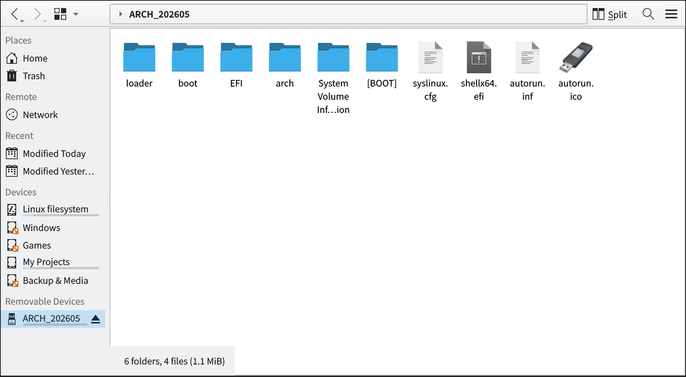

## Arch Linux 安装指南

*作者:Xuda Ye — [ye481@purdue.edu](mailto:ye481@purdue.edu)*

Arch Linux 是一个滚动更新的发行版,强调简洁、极简,以及让用户对系统拥有完全的控制权。它非常适合那些希望从零开始搭建自己的环境、而不愿依赖固有默认配置的用户。其包管理器是 `pacman`,辅以 `yay`、`paru` 等 AUR 助手用于安装社区维护的软件包。

由于 Arch 紧跟上游,它能第一时间提供 Python、C/C++、Rust 等工具链的最新版本,因此非常适合 `llama.cpp` 这类对性能极为敏感的工作负载。代价是它对某些专有软件(例如 MATLAB)的支持较差,而且维护负担比固定发布版的发行版更重。如果你依赖此类软件,或者只是希望拥有一个稳定、低维护成本的系统,选择其他发行版可能更合适。

一些流行的基于 Arch 的下游发行版,例如 [CachyOS](https://cachyos.org/)、[Manjaro](https://manjaro.org/) 和 [EndeavourOS](https://endeavouros.com/),都自带图形化安装器和合理的默认配置。如果你只是想尝试一下 Arch 生态而不愿经历手动安装过程,这些都是不错的起点。此外,如果你正在 Windows 系统上、只需要使用 Arch 的用户态和软件包生态,可以在 [WSL (Windows Subsystem for Linux)](https://learn.microsoft.com/en-us/windows/wsl/) 中运行 Arch——例如通过 [ArchWSL](https://github.com/yuk7/ArchWSL) 项目——这样无需改动你现有的操作系统或磁盘布局。

本指南基于[官方安装文档](https://wiki.archlinux.org/title/Installation_guide)编写,并针对初学者补充了一些说明。它假定系统架构为 `x86_64`,使用 Wi-Fi 联网,系统语言为默认的 `en_US.UTF-8`,并且采用全盘安装的方式擦除单块 NVMe M.2 SSD。如果你想把 Arch 安装到现有磁盘的某个分区上,请参考官方 wiki 或寻求更专业的指导。

### 你需要的物理准备

你需要准备一个 U 盘(至少 4 GB,建议 8 GB 以上)以及最新的 Arch 安装 ISO,后者可以从官方[下载页面](https://archlinux.org/download/)获取。拿到 ISO 之后,根据你当前的操作系统选择合适的工具把 ISO 写入到 U 盘:

- 在 **Windows** 上使用 [Rufus](https://rufus.ie/en/)。
- 在 **macOS 或 Linux** 上使用 [balenaEtcher](https://etcher.balena.io/),或者如果你熟悉命令行工具,直接在终端中使用 `dd`。

注意:这一过程会擦除 U 盘上原有的所有数据,请务必先备份。烧录完成后,U 盘的样子应该与下图类似:

<p align="center">
  
</p>

把 U 盘插入目标机器,进入 BIOS/UEFI 设置(开机时通常按 `F2`、`Del`、`F10` 或 `Esc`——具体按键因厂商而异)。关闭 **Secure Boot** 和 **Fast Boot**,然后把 U 盘移到启动顺序的第一位。保存设置并重启;系统会从 U 盘把 Arch live 环境加载到内存中,并把你带到一个 root shell,之后的所有安装步骤都在此处进行。

第一次从 U 盘启动时,你可能会听到电脑发出短促的"嘀"声——这只是正常的 POST(开机自检)信号,可以放心忽略。live 环境加载完毕后,你应该会看到类似这样的 shell 提示符:

<pre><code><span style="color: red;">root</span>@archiso ~ #
</code></pre>

`root@archiso` 前缀表示你正以 `root` 用户的身份位于 Arch live ISO 环境中,拥有完全的管理员权限。除非另有说明,本指南中后续所有命令都在该提示符下执行。

**小提示:**任何时候按上方向键都可以从命令历史中调出最近输入过的命令。这对修正拼写错误特别方便——按上、改错、回车即可,不必把整行重新输入。如果你不确定某条命令的作用,运行 `man <命令>` 可以打开它的手册页。

### 联网

在安装任何软件包之前,你需要一个可用的网络连接。由于本指南假定使用 Wi-Fi,我们将使用 `iwctl`——这是 Arch live ISO 默认无线后端 **iNet Wireless Daemon (iwd)** 的交互式前端。在 root shell 中通过下面命令启动它:

```bash
iwctl
```

之后你会进入 `iwd` 的交互式提示符:

<pre><code><span style="color: green;">[iwd]</span>#
</code></pre>

从这里开始,后续所有无线相关的命令(列出设备、扫描网络、连接等)都需要在此提示符内执行,而不是在普通 shell 中执行。

首先,列出可用的无线接口:

```
device list
```

你应该会看到一个或多个无线适配器;大多数笔记本上它就叫 `wlan0`。如果你的接口名称不同,请把后续命令中的 `wlan0` 替换成你自己的接口名。

接着,扫描附近的网络。扫描过程本身是静默的,不会有任何输出:

```
station wlan0 scan
```

扫描完成后(通常几秒钟即可),列出已发现的网络:

```
station wlan0 get-networks
```

在结果列表中找到你想加入的 SSID——我们这里称之为 `<network-name>`——然后用下面命令连接:

```
station wlan0 connect <network-name>
```

接着系统会提示你输入网络密码。如果 SSID 中包含空格或特殊字符,请用双引号把它包起来。例如,要连接到名为 `Carol's iPhone` 的热点:

```
station wlan0 connect "Carol's iPhone"
```

连接成功后,可以用 `exit`(或 `Ctrl+D`)退出 `iwctl`,然后在普通 shell 中用 `ping 8.8.8.8` 验证网络是否畅通。

### 识别并分区目标磁盘

在做任何具有破坏性的操作之前,你需要准确识别出 Arch 将被安装到的那块块设备。使用 `lsblk` 列出所有已连接的磁盘及其大小和现有分区,使用 `lsblk -f` 额外显示文件系统类型和标签:

```
lsblk
lsblk -f
```

NVMe SSD 通常显示为 `nvme0n1`、`nvme1n1` 等等——第一个数字是控制器编号,末尾的 `n1` 是命名空间(在消费级硬盘上几乎都是 `n1`)。如果机器上有多个 NVMe SSD,你会看到多个 `nvmeXn1` 条目。

> ⚠️ **重要:**这些控制器编号是由内核在启动时分配的,**不一定**和主板上 M.2 插槽的物理顺序相对应。如果你之后增加、移除或重排了硬盘,它们在重启后也可能改变。因此,在执行下面任何一条命令之前,请务必结合 `lsblk` 显示的容量和现有分区布局来确认目标设备——下文中每一步操作都是破坏性的,会永久擦除所选磁盘上的所有数据。

在本指南的后续部分,我们假定目标 SSD 是 `/dev/nvme0n1`。如果你的设备名称不同,请在每条命令中相应替换。

首先清除该磁盘上现有的所有文件系统签名、分区表以及引导加载程序残留:

```bash
wipefs -af /dev/nvme0n1
```

然后打开交互式 GPT 分区工具:

```bash
gdisk /dev/nvme0n1
```

`gdisk` 完全通过在提示符下输入单个字母命令来操作。这里你会用到的少数几个命令是:

```bash
o   # 创建一个全新的空 GPT 分区表
n   # 新建一个分区
d   # 删除一个已有的分区
p   # 打印当前的分区状态
w   # 把修改写入磁盘并退出
q   # 不保存任何修改直接退出
```

我们建议在动手之前先粗略浏览一下 `man gdisk`,以便了解每条命令的作用。如果在任何时刻你不确定下一步该做什么,都可以按 `q` 安全地退出——只有显式地按 `w` 之后,改动才会真正写入磁盘。

进入 `gdisk` 后,先输入 `p` 打印当前磁盘的概要,再确认一遍自己操作的是正确的设备。在我的机器上输出大致是这样:

```
Disk /dev/nvme0n1: 2000409264 sectors, 953.9 GiB
Model: SKHynix_HFS001TEJ9X115N
Sector size (logical/physical): 512/512 bytes
Disk identifier (GUID): ...
```

下方,`gdisk` 会回到它的主提示符:

```
Command (? for help):
```

之后每一步操作都在这里输入。现在按下面顺序操作。

**第 1 步——创建一个全新的 GPT。** 按 `o`,然后回车。`gdisk` 会给出警告:

```
This option deletes all partitions and creates a new protective MBR.
Proceed? (Y/N):
```

按 `Y` 确认。尽管这里写着 MBR,但它*并不会*把磁盘转换成 MBR——所谓"protective MBR"只是 GPT 在磁盘开头放置的一小段遗留兼容头,用来防止那些不识别 GPT 的旧工具错误地把磁盘当作空盘对待。实际的分区方案仍然是 GPT。

**第 2 步——创建 EFI 系统分区 (ESP)。** 按 `n` 开始新建分区。`gdisk` 会询问分区号:

```
Partition number (1-128, default 1):
```

直接回车接受默认值 `1`,这样它就是磁盘上的第一个分区——对应的块设备名将是 `/dev/nvme0n1p1`。接着 `gdisk` 询问起始扇区:

```
First sector (34-2000409230, default = 2048) or {+-}size{KMGTP}:
```

再次回车,从第一个对齐的空闲扇区(`2048`)开始。之后会询问结束扇区:

```
Last sector (2048-2000409230, default = 2000408575) or {+-}size{KMGTP}:
```

输入 `+1G`(注意开头的 **`+`** ——它告诉 `gdisk` 把这个值解释为*大小*而不是绝对扇区号),为引导分区预留 1 GiB 的空间。最后,`gdisk` 会询问分区类型:

```
Hex code or GUID (L to show codes, Enter = 8300):
```

输入 `EF00` 然后回车。这是 EFI 系统分区的类型代码,固件在启动时会查找它。`gdisk` 会确认:

```
Changed type of partition to 'EFI system partition'
```

现在可以运行 `p` 来确认新分区已经正确出现在布局中,大小约为 1 GiB,类型为 `EFI system partition`。

**第 3 步——创建交换分区。** 交换空间(swap)是内核在物理内存吃紧时作为溢出区使用的磁盘空间:当内存压力较大时,不太活跃的内存页可以被换出到 swap 来腾出空间。它也是实现挂起到磁盘(休眠)的基础——休眠时整个 RAM 内容都会先写入 swap,然后机器才能关机。常见的经验法则是分配 **8–32 GiB**,具体取决于工作负载和 RAM 大小。如果你的机器有 64 GiB 或更多的 RAM(通常用于重型计算或 ML 工作负载)且不打算使用休眠,完全可以省略 swap 分区。

按 `n` 然后回车,按照第 2 步同样的流程创建分区 2(分区号和起始扇区的默认值依然是你要的)。当到达结束扇区提示时:

```
Last sector (2099200-2000409230, default = 2000408575) or {+-}size{KMGTP}:
```

输入 `+32G` 为 swap 预留 32 GiB(根据你之前决定的大小相应调整数字)。在分区类型提示处输入 `8200`——这是 Linux swap 的 GUID 代码。`gdisk` 会确认:

```
Changed type of partition to 'Linux swap'
```

**第 4 步——创建根分区。** 磁盘上剩余的空间将用于 Linux 根文件系统 (`/`),其中包含内核、系统库、应用程序、用户数据,以及所有不在 ESP 上的内容。按 `n`,之后所有提示都直接按回车——默认值(分区号 `3`、从第一个空闲扇区开始、到磁盘的最后一个扇区结束、类型 `8300` 即 *Linux filesystem*)正是你想要的。

分区创建完成后,输入 `p` 打印最终布局。它应该看起来类似:

```
Number Start (sector)   End (sector)    Size        Code   Name
1      2048             2099199         1024.0 MiB  EF00   EFI system partition
2      2099200          69208063        32.0 GiB    8200   Linux swap
3      69208064         2000408575      920.9 GiB   8300   Linux filesystem
```

到此为止,实际上还没有任何东西被写入磁盘——所有改动都还存在于 `gdisk` 的内存副本中。花一点时间仔细核对一下大小和类型,然后用 `w` 提交改动:

```
Command (? for help): w

Do you want to proceed? (Y/N): Y
```

`gdisk` 会把新的 GPT 写入磁盘并退回到 shell。此后,这些分区就以 `/dev/nvme0n1p1`、`/dev/nvme0n1p2`、`/dev/nvme0n1p3` 的形式实际存在于 SSD 上了。

### 格式化分区并挂载

此时磁盘上三个分区已经存在,但还没有任何文件系统——运行 `lsblk -f` 会看到 `nvme0n1p1`、`nvme0n1p2`、`nvme0n1p3` 的 `FSTYPE` 列都是空的。我们现在按各自的用途分别格式化:

```bash
mkfs.fat -F32 /dev/nvme0n1p1         # FAT32 用于 EFI 系统分区
mkswap /dev/nvme0n1p2                # 初始化 swap 签名
mkfs.btrfs -L System /dev/nvme0n1p3  # Btrfs 用于根文件系统
```

对每条命令做一些简要说明:

- **`mkfs.fat -F32`** 是 ESP 的必须选择。UEFI 固件只能读取 FAT(通常是 FAT32),所以这不是可选项——而是由启动规范决定的。
- **`mkswap`** 并不是通常意义上的创建文件系统;它只是写入一个小小的 swap 头,让内核能识别出该分区是 swap 空间。
- **`mkfs.btrfs -L System`** 把根分区格式化为 [Btrfs](https://wiki.archlinux.org/title/Btrfs),这是一种现代的写时复制(CoW)文件系统,支持快照、透明压缩和子卷——这些特性在系统回滚和备份时非常方便。`-L System` 标志设置了一个可读的标签;你可以改成 `Root`、`Arch`、`C` 或任何你喜欢的名字。标签会出现在 `lsblk -f` 和文件管理器中,也可以通过 `LABEL=...` 在 `/etc/fstab` 中引用,但它不会影响文件系统的工作方式。如果省略 `-L`,文件系统就没有标签(`lsblk` 会改为显示通用类型名)。

如果你更偏好简单、保守的选择,也可以把根分区格式化为 **ext4**:

```bash
mkfs.ext4 -L System /dev/nvme0n1p3
```

ext4 是大多数 Linux 发行版的默认文件系统,极为稳定且为人熟知——代价是缺少 Btrfs 提供的快照和压缩特性。两种选择都是合理的默认值;无论选哪种,本指南后续步骤都完全相同。

再次运行 `lsblk -f` 确认每个分区都报告了预期的文件系统类型(`vfat`、`swap`、`btrfs`/`ext4`)。文件系统准备就绪后,我们把它们挂载到 `/mnt` 之下,这样 live ISO 就能把新系统*安装到*目标磁盘里。从概念上讲,重启进入新系统后,现在的 `/mnt` 就会变成新系统的 `/`。

```bash
mount /dev/nvme0n1p3 /mnt               # 把根分区挂载到 /mnt
mount --mkdir /dev/nvme0n1p1 /mnt/boot  # 创建 /mnt/boot 并把 ESP 挂到那里
swapon /dev/nvme0n1p2                   # 启用 swap
```

几点值得注意的细节:

- 顺序很重要:必须**先**挂载根分区,因为只有当根文件系统位于 `/mnt` 下之后,`/mnt/boot` 这个目录才会存在。
- 第二条 `mount` 中的 `--mkdir` 标志会让 `mount` 在目标目录不存在时自动创建它,省去了单独执行 `mkdir /mnt/boot` 的步骤。
- `swapon` 并不会做任何格式化(那一步已经由 `mkswap` 完成);它只是激活 swap 分区,让内核可以立刻开始使用它。

执行完这些命令后,`/mnt` 中应当恰好包含一个目录——`boot`——并且 `lsblk` 应该把三个分区都显示为已挂载/已激活。

### 安装基础系统

分区挂载完毕后,我们就可以用 `pacstrap`——Arch 的引导安装器——把一个最小化的 Arch 系统下载并安装到 `/mnt`。`-K` 标志会在目标系统中初始化一个全新的 pacman 密钥环(对于全新安装非常重要,否则后续的软件包签名校验可能失败)。

```bash
pacstrap -K /mnt base linux linux-firmware base-devel networkmanager grub efibootmgr micro sudo
```

简单说明一下每个软件包的作用:

- **`base`** —— 最小化的核心工具集和 `pacman` 本身。
- **`linux`** —— Linux 内核(如果你想用长期支持版,可以改成 `linux-lts`)。
- **`linux-firmware`** —— 用于 Wi-Fi、显卡及其他硬件的专有固件 blob。省略它可能导致系统能启动但无法与网卡通信。
- **`base-devel`** —— 常用构建工具(`make`、`gcc`、`pkgconf` 等)的元包,后续构建 AUR 软件包时会用到。
- **`networkmanager`** —— 安装后阶段的网络守护进程。一旦你从 live ISO 重启之后,`iwctl` 就不再可用,`NetworkManager` 是最简单的替代方案。
- **`grub`** + **`efibootmgr`** —— 引导加载程序,以及把它注册到 UEFI 固件中的工具。
- **`micro`** —— 一款小巧的、无模式的终端编辑器,自带熟悉的 Ctrl-S / Ctrl-C / Ctrl-Z 快捷键。如果你从 Windows 或 macOS 过来,我强烈推荐它而不是 `vim` 或 `nano`;它没有模式编辑的学习曲线,行为符合普通文本编辑器的直觉。
- **`sudo`** —— 让普通用户可以以 root 身份执行命令,我们稍后会配置它。

接下来,为新系统生成 `/etc/fstab`,这样内核才知道开机时应该挂载哪些文件系统;然后切换根目录进入已安装的系统:

```bash
genfstab -U /mnt >> /mnt/etc/fstab
arch-chroot /mnt
```

`genfstab -U` 会为当前每一个已挂载的文件系统写入一行,并通过 UUID 来标识它们(UUID 在重启和磁盘重新编号时都是稳定的——不像 `/dev/nvmeXn1pY` 那样的路径)。接着 `arch-chroot` 会把 `/mnt` 当作新的根目录:从这一刻起直到你 `exit` 之前,所有命令都如同你已经启动到了刚装好的新系统中一样执行。

执行 `arch-chroot` 之后,提示符会变成类似这样:

```
[root@archiso /]#
```

主机名仍然显示为 `archiso`(我们很快会设置一个真正的主机名),但运行 `pwd` 现在会返回 `/`,说明你已经位于新的根文件系统内部。从这里开始,你安装或配置的所有内容都会持久化保存到 SSD 上。

在 chroot 中运行 `date` 会显示 UTC 时间,因为新系统还没配置时区。要选择你的时区,先浏览 `/usr/share/zoneinfo` 下可用的时区文件:

```bash
ls /usr/share/zoneinfo/Asia      # 亚洲城市
ls /usr/share/zoneinfo/America   # 美洲城市
ls /usr/share/zoneinfo/Europe    # 欧洲城市
```

每个子目录中包含每个代表性城市的一个文件。找到合适的那个之后,把它链接到 `/etc/localtime`,然后再把当前时间写回硬件时钟,让内核和 BIOS 时间保持一致:

```bash
ln -sf /usr/share/zoneinfo/America/New_York /etc/localtime   # 示例:美国东部时区
hwclock --systohc
```

如果是中国大陆用户,对应的命令是:

```bash
ln -sf /usr/share/zoneinfo/Asia/Shanghai /etc/localtime
hwclock --systohc
```

`ln -sf` 标志组合可以一步完成创建(或替换)符号链接。`hwclock --systohc` 则把硬件 (RTC) 时钟同步成现在已经正确的系统时间,前提是 RTC 设置为 UTC——这是 Linux 的标准约定。再运行一次 `date` 验证显示的时间与你当地的时钟一致。

接下来,配置系统区域(locale)。`/etc/locale.gen` 列出了 Arch *可以*生成的所有区域,默认全部被注释掉;我们启用想要的那一行,然后运行 `locale-gen` 来生成对应的区域数据:

```bash
echo "en_US.UTF-8 UTF-8" >> /etc/locale.gen
locale-gen
```

你应该会看到类似下面的输出:

```
Generating locales...
  en_US.UTF-8... done
Generation complete.
```

然后写入 `/etc/locale.conf`,让新系统在启动时真正*使用*这个区域:

```bash
echo "LANG=en_US.UTF-8" > /etc/locale.conf
```

接着设置机器的主机名。这是你的电脑用来标识自己的简短名称——本地(出现在 shell 提示符中)和网络上(用于 SSH、mDNS 等)都会用到:

```bash
echo "archbox" > /etc/hostname
```

你可以随意取名——可以是硬件昵称(例如 `rog`、`thinkpad`),也可以是描述性的标签(例如 `archbox`、`dev-laptop`)。等系统启动并运行 `sshd` 之后,可以从另一台机器这样登录:

```bash
ssh <user>@<hostname>     # 如果你的局域网通过 mDNS / DNS 能解析主机名
ssh <user>@<ip-address>   # 否则直接使用机器的 IP 地址
```

设置 root 密码(系统会提示你输入两次,且屏幕上不会显示):

```bash
passwd
```

最后,创建你的第一个普通用户。`-m` 标志会在 `/home/<user>` 下创建家目录,`-G wheel` 把用户加入到 `wheel` 组——这是 Arch 约定中允许使用 `sudo` 的用户所在的组:

```bash
useradd -mG wheel <user>
passwd <user>
```

把 `<user>` 替换为你想要的用户名(小写,不含空格)。仅仅加入 `wheel` 组还不能获得 `sudo` 权限——你还需要编辑 `/etc/sudoers`。用下面命令打开它:

```bash
EDITOR=micro visudo
```

`visudo` 会在 `micro`(或 `EDITOR` 指向的其他编辑器)中打开该文件,并在保存前校验语法,从而防止你因为写错 `sudoers` 文件而把自己锁在外面。在大约第 125 行附近,取消下面这一行的注释(去掉开头的 `#`):

```
%wheel ALL=(ALL:ALL) ALL
```

然后按 **Ctrl+S** 保存,按 **Ctrl+Q** 退出 `micro`。完成后,新用户就可以正常使用 `sudo` 了。

### 安装引导加载程序并启用网络

GRUB(GRand Unified Bootloader)是 Linux 上使用最广泛的引导管理器。它是一个小程序,在 UEFI 固件移交控制权之后立刻运行,定位 Linux 内核,并把它加载到内存中。如果没有安装引导加载程序,固件就找不到新系统的入口,机器也就根本无法启动到 Arch 中。

把 GRUB 安装到 ESP 上,然后生成它的配置文件:

```bash
grub-install --target=x86_64-efi --efi-directory=/boot --bootloader-id="Arch Linux"
grub-mkconfig -o /boot/grub/grub.cfg
```

简要说明一下这些参数:

- **`--target=x86_64-efi`** —— 构建一个 64 位 EFI 引导加载程序(匹配我们假定的 `x86_64` UEFI 系统)。
- **`--efi-directory=/boot`** —— ESP 在 chroot 内部的挂载点(我们之前把 `/dev/nvme0n1p1` 挂载到了 `/mnt/boot`,从 chroot 视角看就是 `/boot`)。
- **`--bootloader-id="Arch Linux"`** —— 将在固件启动菜单中显示的标签。你可以随意改成自己喜欢的名字(例如 `"Arch"`、`"My Linux"`)。

接着 `grub-mkconfig` 会扫描系统,检测已安装的内核,并生成 `/boot/grub/grub.cfg`——这才是 GRUB 在启动时实际读取的文件。

下一步,启用 `NetworkManager`,这样新系统在第一次启动时就有可用的网络(记住:`iwctl` 只存在于 live ISO 中,重启之后就没了):

```bash
systemctl enable NetworkManager
```

到此安装就完成了。退出 chroot,返回到 live ISO 的 shell:

```bash
exit
```

然后卸载 `/mnt` 下所有文件系统并关机:

```bash
umount -R /mnt
shutdown now
```

`-R` 标志表示递归卸载,所以 `/mnt/boot` 会在 `/mnt` 本身之前先被卸载。这能保证在断电之前所有挂起的写入都已经刷到磁盘上。注意这条命令是 `umount`(没有第二个 `n`)——这是新手最常打错的拼写之一。

机器关机后,把 U 盘拔下来。下次开机时,UEFI 固件就会找到你刚安装好的 Arch 系统,并从 ESP 加载 GRUB。可以稍作休息了——重头戏已经结束。下次你看到提示符时,就是刚装好的 Arch 用 `login:` 一行跟你打招呼,你可以用之前创建的那个普通用户登录了。

### 安装后的配置

第一次启动后,你会进入一个纯文本登录提示符。用你在安装过程中创建的那个普通用户登录。下面这些步骤涵盖让新系统达到日常可用的最低限度配置。

#### 重新连接网络

`NetworkManager` 已经启用,但它对任何 Wi-Fi 网络都还一无所知——你之前用 `iwctl` 输入的凭据只存在于 live ISO 中。启动文本模式 UI:

```bash
nmtui
```

选择 **Activate a connection**,从附近网络列表中选中你的 SSID,输入密码,然后确认。从此 `NetworkManager` 就会记住这个网络,并在每次启动时自动连接。

如果你更喜欢一行命令完成同样的事,可以在 shell 中:

```bash
nmcli device wifi connect "<SSID>" password "<passphrase>"
```

#### 更新系统

刚安装好的 Arch 在你启动的时候,通常已经比上游落后好几天了。把所有东西更新到最新:

```bash
sudo pacman -Syu
```

`-S` 调用同步操作,`-y` 从镜像源刷新软件包数据库,`-u` 把所有已安装的软件包升级到最新版本。在 Arch 中,日常的"系统更新"也是这一条命令——没有所谓"大版本升级"的概念。

#### 安装桌面环境(可选)

如果你想要图形界面,可以挑一个流行的桌面环境用 `pacman` 安装。常见的选择:

- **[GNOME](https://wiki.archlinux.org/title/GNOME)** —— 简洁、有自己的设计哲学、对触摸友好;体验上最接近 macOS。
- **[KDE Plasma](https://wiki.archlinux.org/title/KDE)** —— 高度可定制,默认布局类似 Windows。
- **[Cinnamon](https://wiki.archlinux.org/title/Cinnamon)** —— 传统桌面隐喻,轻量级,对从 Linux Mint 过来的用户非常友好。
- **[Hyprland](https://wiki.archlinux.org/title/Hyprland)** —— 现代化的平铺式 Wayland 合成器,适合以键盘为中心的工作流。

你也可以一直停留在纯命令行模式——对于服务器、开发机器或极简主义的搭建,这是完全合理的选择。Arch Wiki 上有一篇非常好的[可用桌面环境概览](https://wiki.archlinux.org/title/Desktop_environment),其中包含安装命令和截图。

本指南到这里就结束了,因为再往后的内容都取决于个人偏好。祝你享受新的 Arch 系统。
