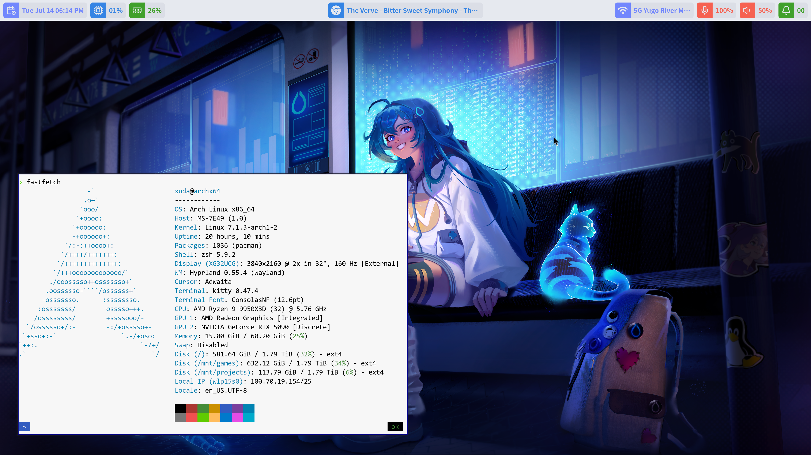

# Arch-Install

A personal, beginner-friendly walkthrough for installing Arch Linux on a single NVMe SSD and turning it into a daily-driver Hyprland workstation — including all of the dotfiles, fonts, and configuration files I actually use.

*个人向、面向新手的 Arch Linux 安装与配置指南——从单块 NVMe SSD 上的全新安装，一路到一台日常可用的 Hyprland 工作站，并附带我实际使用的所有 dotfiles、字体与配置文件。*

<p align="center">
  
</p>

---

## English

### What's in this repository

| Path | Purpose |
|---|---|
| [INSTALL.md](INSTALL.md) | Step-by-step base installation guide — booting from USB, partitioning with `gdisk`, formatting with `mkfs`, `pacstrap`, `arch-chroot`, GRUB, user setup. |
| [CONFIG.md](CONFIG.md) | Post-install configuration — zsh + Oh My Zsh, Hyprland + Wayle (desktop bar, notifications, and wallpaper), kitty, Dolphin, PipeWire audio, fonts, fcitx5 Chinese input, NVIDIA drivers, an AUR helper, and VS Code dotfiles. |
| [config/](config/) | My personal dotfiles for Hyprland, Wayle, kitty, micro, and fontconfig — drop them into `~/.config/`. |
| [fonts/](fonts/) | The patched **Consolas Nerd Font** (Regular + Italic) referenced by the kitty config. |
| [INSTALL_SC.md](INSTALL_SC.md) / [CONFIG_SC.md](CONFIG_SC.md) | Simplified Chinese translations (machine-generated; English versions are canonical). |

> 🔈 **Using a Creative Sound BlasterX G6?** The G6-specific setup that used to live in this repo has moved to its own project, [`Sound-BlasterX-G6-Control`](https://github.com/xuda-ye-math/Sound-BlasterX-G6-Control). One-line install on Arch: `yay -S sound-blasterx-g6-control-git`.

### Quick start

Clone the repo and start with `INSTALL.md`:

```bash
git clone https://github.com/xuda-ye-math/Arch-Install.git
cd Arch-Install
```

Then read `INSTALL.md` end-to-end for the base install, followed by `CONFIG.md` for everything you'd typically want on top. Each section in `CONFIG.md` is self-contained, so feel free to cherry-pick.

### Who this is for

- New Arch users who want a single linear guide instead of jumping around the wiki.
- People comfortable with Linux but new to manual partitioning / `arch-chroot`.
- Anyone curious about a no-frills Hyprland setup with a light theme and Consolas-based monospace.

### Caveats

- Assumes an `x86_64` UEFI system, Wi-Fi networking, `en_US.UTF-8`, and a clean install that erases a single NVMe M.2 SSD. For other layouts, defer to the official [Arch wiki](https://wiki.archlinux.org/title/Installation_guide).
- The configuration choices in `CONFIG.md` and `config/` are *mine* — light backgrounds, Consolas Nerd Font, `Super+letter` app launchers. They are not "the right way" to set up Arch; they are the way I happen to like it.

---

## 中文

### 仓库内容

| 路径 | 作用 |
|---|---|
| [INSTALL.md](INSTALL.md) | 一步步的基础安装指南——从 U 盘启动、用 `gdisk` 分区、用 `mkfs` 格式化、`pacstrap`、`arch-chroot`、GRUB，直到用户配置。 |
| [CONFIG.md](CONFIG.md) | 安装后的配置——zsh + Oh My Zsh、Hyprland + Wayle（桌面栏、通知和壁纸）、kitty、Dolphin、PipeWire 音频、字体、fcitx5 中文输入法、NVIDIA 显卡驱动、AUR 助手以及 VS Code 配置。 |
| [config/](config/) | 我个人的 dotfiles，包含 Hyprland、Wayle、kitty、micro 以及 fontconfig 的配置——直接复制到 `~/.config/` 即可。 |
| [fonts/](fonts/) | kitty 配置所引用的、打过补丁的 **Consolas Nerd Font**(Regular + Italic)。 |
| [INSTALL_SC.md](INSTALL_SC.md) / [CONFIG_SC.md](CONFIG_SC.md) | 简体中文译文(机器翻译；以英文版为准)。 |

> 🔈 **在用 Creative Sound BlasterX G6？** 这份配置以前包含的 G6 专用设置已经独立成单独的项目 [`Sound-BlasterX-G6-Control`](https://github.com/xuda-ye-math/Sound-BlasterX-G6-Control)。Arch 上一行安装：`yay -S sound-blasterx-g6-control-git`。

### 快速开始

克隆仓库，然后从 `INSTALL.md` 开始:

```bash
git clone https://github.com/xuda-ye-math/Arch-Install.git
cd Arch-Install
```

通读 `INSTALL.md` 完成基础系统的安装，然后参考 `CONFIG.md` 安装日常使用所需的其余内容。`CONFIG.md` 中每一节都自洽完整，可按需挑选执行。

### 适合的读者

- 想要一份按顺序读完整篇的 Arch 新手，而不是在 wiki 上来回跳。
- 对 Linux 已经熟悉，但还没手动分区或用过 `arch-chroot` 的用户。
- 想看看一份没有花里胡哨、以浅色主题和 Consolas 等宽字体为主的 Hyprland 配置是什么样子的人。

### 注意事项

- 本指南假定系统是 `x86_64` UEFI，联网方式是 Wi-Fi，系统语言为 `en_US.UTF-8`，并采用全盘安装的方式擦除单块 NVMe M.2 SSD。如果你的情况与此不同，请参考 [Arch 官方 wiki](https://wiki.archlinux.org/title/Installation_guide)。
- `CONFIG.md` 与 `config/` 中的配置选择是我个人的——浅色背景、Consolas Nerd Font、`Super+字母` 形式的应用启动快捷键。这并不是"正确"的 Arch 配置方式，而只是我恰好喜欢的方式。
