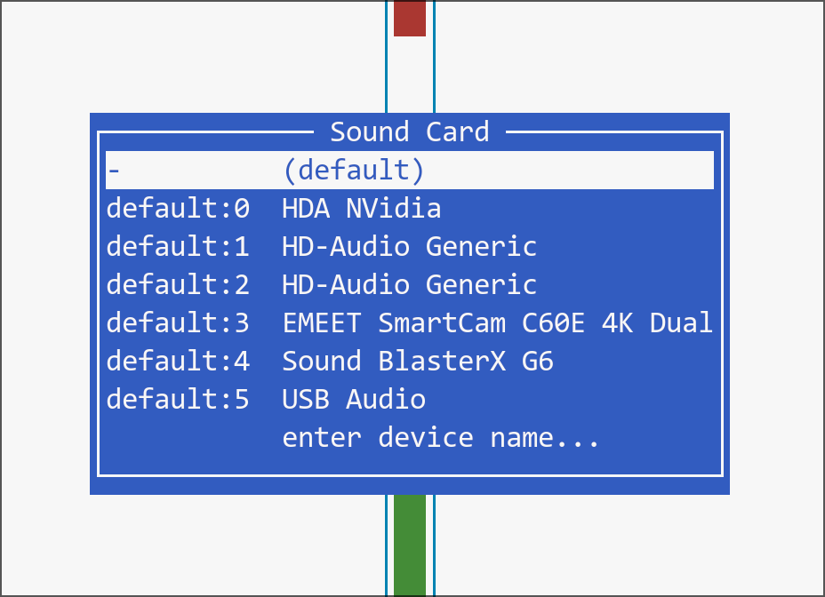

## Creative Sound BlasterX G6 on Arch Linux

### Before you start

These notes assume that the Sound BlasterX G6 (just **"G6"** from here on) is plugged into one of the **USB-A** ports on the back of your motherboard — the rectangular, legacy USB connector that virtually every G6 has shipped with.

Some newer revisions of the G6 may use a **USB-C** port instead. If yours does, the device may enumerate slightly differently (a different ALSA card name, a different PipeWire description, possibly an extra UAC2 profile). The instructions below were written and tested only against the USB-A version — if you're on a USB-C unit, treat the steps as a starting point rather than a guaranteed recipe.

> ⚠️ **Run `alsainit` manually first.** Before wiring it into `hyprland.conf` or any startup service, execute it once by hand and walk through the checks in [Verify your microphone](#verify-your-microphone) to confirm it works on your unit.

### Install the audio stack

Before any of the steps below will produce useful output, make sure the userspace tools that the script (and your daily sound setup) rely on are installed:

```bash
sudo pacman -S usbutils pipewire pipewire-alsa pipewire-pulse alsa-utils wireplumber
```

What each package gives you:

- **`usbutils`** — provides `lsusb`, used to confirm the G6 actually enumerates on the USB bus before debugging any further.
- **`pipewire`** — the audio server itself, the modern replacement for PulseAudio that also handles JACK and Bluetooth routing.
- **`pipewire-pulse`** — the PulseAudio-compatible drop-in that ships `pactl`, the CLI `alsainit` uses to look up the G6 sink/source and set defaults.
- **`pipewire-alsa`** — an ALSA-to-PipeWire shim so legacy ALSA apps (anything that still opens `/dev/snd/...` directly or talks to `default` via libasound) get routed through PipeWire instead of grabbing the card exclusively.
- **`alsa-utils`** — provides `amixer` (used by `alsainit` to configure the G6's capture mux and gain) along with handy debugging tools like `aplay -l`, `arecord`, and `alsamixer`.
- **`wireplumber`** — PipeWire's session/policy manager. It's what restores routes after login and what occasionally fights the script — understanding that it exists is the first step to understanding why the delay in the startup section matters.

Once the packages are installed, verify the G6 is visible on the USB bus:

```text
$ lsusb | grep G6
Bus 003 Device 004: ID 041e:3256 Creative Technology, Ltd Sound BlasterX G6
```

A matching `041e:3256` line means the device is properly plugged in and the kernel sees it. If `lsusb` prints nothing, the cable / port / device itself is the problem, and none of the steps below will help.

### Identify the G6 in `alsamixer`

With the audio stack installed, the next step is to confirm ALSA itself sees the G6 as a distinct sound card. From a terminal, run:

```bash
alsamixer
```

This opens a curses TUI that defaults to whichever card ALSA considers active. Press **F6** to bring up the *Sound Card* selector, which lists every audio device the kernel has registered. On my machine the menu looks like this:

<p align="center">
  
</p>

Most of those entries are *not* what you want, and picking the wrong one is the single most common reason `amixer` / `alsainit` look like they "did nothing":

- **`HDA NVidia`** — the audio output that piggybacks on your NVIDIA GPU's HDMI/DisplayPort. Useful only if you actually send sound out of an HDMI monitor.
- **`HD-Audio Generic`** (often listed more than once) — the realtek-style codec built into the motherboard. Skip it; we're explicitly bypassing the onboard chip in favor of the G6.
- **`EMEET SmartCam …`** (or whatever webcam is shown here) — the microphone array on your USB webcam. Not the G6.
- **`USB Audio`** — on this machine that name belongs to the 3.5 mm headphone jack exposed as a separate USB audio device. Also not the G6.
- **`Sound BlasterX G6`** — the only entry that is actually the G6.

You don't actually need to select `Sound BlasterX G6` here if you're planning to drive everything through `alsainit` — this step is purely a detection check. If you only see the other entries and **no** `Sound BlasterX G6` line at all, ALSA hasn't recognized the G6 yet, and you need to revisit the USB / kernel side before going further. Press **Esc** to close the menu and exit alsamixer with **Q**.

### How `alsainit` works

The script lives at [`config/local-bin/alsainit`](config/local-bin/alsainit) in this repo, and is meant to be installed to `~/.local/bin/alsainit` (the same `~/.local/bin` you set up for the [`open` helper](CONFIG.md#install-the-open-helper-script)). Its body is short:

```sh
#!/bin/sh
amixer -c G6 sset 'PCM Capture Source' 'External Mic' > /dev/null
amixer -c G6 sset 'External Mic' Capture 100% cap     > /dev/null

g6_sink=$(pactl list short sinks   | awk '/^[0-9]+\talsa_output\..*Sound_BlasterX_G6.*analog-stereo/{print $2; exit}')
g6_srce=$(pactl list short sources | awk '/^[0-9]+\talsa_input\..*Sound_BlasterX_G6.*analog-stereo/ {print $2; exit}')

[ -n "$g6_sink" ] && pactl set-default-sink   "$g6_sink"
[ -n "$g6_srce" ] && pactl set-default-source "$g6_srce"
```

It does four things, in order:

1. **Selects the microphone jack inside the G6's ADC mux.** The G6 exposes a single analog-to-digital converter that can be wired to several physical inputs (Line In, External Mic, optical, etc.). The first `amixer` call sets that selector — ALSA control `PCM Capture Source` on card `G6` — to `External Mic`, the front-panel mic jack. Without this step the G6 typically powers up routing Line In and the OS sees pure silence on your "microphone."
2. **Unmutes the microphone and pushes its gain to maximum.** The second `amixer` call enables capture on the `External Mic` element and sets it to `100%`, which corresponds to roughly +9 dB of analog gain on this hardware. That's the level I've found makes a standard 3.5 mm headset mic sit at a usable input volume; if you're using a hot condenser or a line-level source, dial the percentage down so you don't clip.
3. **Resolves the G6's PipeWire sink and source by model name, not serial.** The two `pactl … | awk …` lines scan `pactl list short sinks/sources` for nodes whose name matches `alsa_output.*Sound_BlasterX_G6.*analog-stereo` (and the equivalent `alsa_input` pattern). Matching on the model substring rather than a USB-specific serial means the same script keeps working if you swap units or move the box between machines.
4. **Promotes them to the system defaults.** `pactl set-default-sink` / `set-default-source` make the G6 the default speaker and microphone for every PipeWire client that asks for "the default" output/input. Both assignments are guarded by `[ -n "$g6_sink" ]` / `[ -n "$g6_srce" ]`, so the script is a harmless no-op when the G6 isn't currently plugged in.

### Verify your microphone

First copy the script from the repo into your `~/.local/bin` (the same directory you set up for the [`open` helper](CONFIG.md#install-the-open-helper-script)):

```bash
mkdir -p ~/.local/bin
# Heads up: if ~/.local/bin/alsainit already exists, this will overwrite it.
cp config/local-bin/alsainit ~/.local/bin
chmod +x ~/.local/bin/alsainit
```

Then run it by hand from a terminal:

```bash
~/.local/bin/alsainit
```

It prints nothing on success — that's expected. The three checks below confirm it actually did its job:

1. **Default output is the G6.** `pactl get-default-sink` should print a node name containing `Sound_BlasterX_G6 … analog-stereo`:

   ```text
   $ pactl get-default-sink
   alsa_output.usb-Creative_Technology_Ltd_Sound_BlasterX_G6_100054476F1-00.analog-stereo
   ```

2. **Default input is the G6.** Same idea for the source — `pactl get-default-source` should print the matching `alsa_input.…analog-stereo` name:

   ```text
   $ pactl get-default-source
   alsa_input.usb-Creative_Technology_Ltd_Sound_BlasterX_G6_100054476F1-00.analog-stereo
   ```

   If you instead see your webcam or the onboard HD-Audio codec here, the `pactl set-default-source` step in `alsainit` couldn't find a matching node (re-check the regex / your G6's PipeWire description). The trailing hex (`100054476F1` above) is the G6's USB serial and will differ on your unit — that's why `alsainit` matches on the model substring instead.

3. **A round-trip recording captures your voice.** Speak for a few seconds into the External Mic input while running:

   ```text
   $ arecord -d 3 test.wav && aplay test.wav
   Warning: Some sources (like microphones) may produce inaudible results
            with 8-bit sampling. Use '-f' argument to increase resolution
            e.g. '-f S16_LE'.
   Recording WAVE 'test.wav' : Unsigned 8 bit, Rate 8000 Hz, Mono
   Playing WAVE 'test.wav' : Unsigned 8 bit, Rate 8000 Hz, Mono
   ```

   `arecord` captures three seconds of audio to `test.wav`; `aplay` plays it back through the current default sink. The 8-bit / 8 kHz / mono defaults shown above are intentionally crude — they're enough to confirm capture is working, and the warning about resolution is just `arecord` reminding you to pass `-f S16_LE` for anything other than a smoke test. If you hear yourself, capture is fully wired up.

Only once all three checks pass is it safe to move on and wire the script into your login flow.

> 🎙️ **For real recording, use OBS Studio.** `arecord` / `aplay` are perfect for a one-shot sanity check, but they're not the tool you'd reach for to actually capture voice or screen content. If you want a high-quality voice and video recording backend that also picks up the G6 as a source out of the box (because we've already promoted it to the default PipeWire input above), install [OBS Studio](https://obsproject.com/):
>
> ```bash
> sudo pacman -S obs-studio
> ```
>
> To record the whole desktop on Hyprland/Wayland, add a **Screen Capture (PipeWire)** source in OBS (`Sources` panel → `+` → `Screen Capture (PipeWire)`) and pick the monitor when the xdg-desktop-portal dialog pops up. With the G6 already promoted to the default PipeWire input/output, OBS should also pick up the microphone and the desktop's internal system audio automatically. See [`obs.mp4`](obs.mp4) in this folder for an example clip captured this way (4K screen capture, microphone + internal system sound recorded together).

### How to add it to hyprland startup

Once the three checks above pass, you can have Hyprland run `alsainit` for you on every login. Add this single line to `~/.config/hypr/hyprland.conf`, alongside your other `exec-once` entries:

```ini
exec-once = sh -c 'sleep 5 && $HOME/.local/bin/alsainit'
```

> ⚠️ **A `sleep <n>` delay is required.** WirePlumber restores its session-saved routes a few seconds after login and will silently overwrite `alsainit`'s changes if it runs first. The delay lets WirePlumber finish first so the script's settings stick. `sleep 5` is a safe default — drop to `sleep 3` on a fast SSD, raise to `sleep 10` for a slow login.

Reload Hyprland (`hyprctl reload`) or log out and back in. After the next login, give it a few seconds and re-run the mic test — it should pass without you typing `alsainit`.